<h1 align="center">
  🛡️ Fraud Detection & Risk Scoring System
</h1>

<p align="center">
  <b>BDA501 — Big Data Analytics Capstone Project</b><br>
  FPT University · Semester 2026 · Group <b>RocketUpTeam</b>
</p>

<p align="center">
  
  
  
  
  
  
  
  
</p>

---

## 📌 Executive Summary

An end-to-end, production-grade fraud detection and real-time risk scoring platform built on the **IEEE-CIS Fraud Detection** dataset (590,540 transactions, 434 raw attributes).

The platform combines **Apache Spark** for high-throughput distributed data preprocessing, **CatBoost** gradient boosting with **Isotonic Calibration** for probabilistic risk scoring, **TreeSHAP** for local feature explainability, a **FastAPI** backend microservice, and an interactive **React** operational dashboard for human analysts.

---

## 📐 Overall System Architecture

<p align="center">
  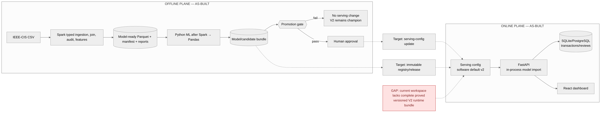
</p>

The platform is structured into four decoupled, contract-governed subsystems:

| Subsystem | Core Technologies | Primary Responsibilities |
|---|---|---|
| 🔄 **1. Data Processing Subsystem** | Apache Spark (PySpark), Parquet, PyArrow | Distributed ETL, left joins, temporal splitting, feature engineering (68 features), data contracts. |
| 🧠 **2. Model Training Subsystem** | CatBoost, LightGBM, XGBoost, Scikit-learn, MLflow | Model family comparison, hyperparameter tuning, isotonic calibration, threshold selection, automated promotion gate. |
| ⚡ **3. Backend Service Subsystem** | FastAPI, PostgreSQL, SQLAlchemy, Docker | Real-time risk scoring API (0–100), TreeSHAP feature attributions, database persistence, transaction queue management. |
| 🖥️ **4. Frontend Dashboard Subsystem** | React, TypeScript, Vite, CSS Modules | Transaction monitoring queue, risk breakdown visualizations, SHAP explanation charts, manual analyst review workflow. |

---

## 📊 Key Performance Indicators & Benchmark Results

<table>
  <thead>
    <tr>
      <th>Metric</th>
      <th>Validation Selection</th>
      <th>Holdout Evaluation</th>
      <th>Target Threshold</th>
      <th>Status</th>
    </tr>
  </thead>
  <tbody>
    <tr>
      <td><b>🎯 PR-AUC</b></td>
      <td><code>0.5806</code></td>
      <td><code>0.4266</code></td>
      <td>≥ <code>0.4582</code></td>
      <td>❌ Failed Gate</td>
    </tr>
    <tr>
      <td><b>📈 ROC-AUC</b></td>
      <td><code>0.9081</code></td>
      <td><code>0.8781</code></td>
      <td>≥ <code>0.8746</code></td>
      <td>✅ Passed Gate</td>
    </tr>
    <tr>
      <td><b>🔍 Precision</b></td>
      <td><code>0.3970</code></td>
      <td><code>0.3820</code></td>
      <td>≥ <code>0.3000</code></td>
      <td>✅ Passed Gate</td>
    </tr>
    <tr>
      <td><b>📡 Recall</b></td>
      <td><code>0.6220</code></td>
      <td><code>0.5182</code></td>
      <td>—</td>
      <td>✅ Operational</td>
    </tr>
    <tr>
      <td><b>📐 Brier Score</b></td>
      <td><code>0.0236</code></td>
      <td><code>0.0248</code></td>
      <td>Non-regression</td>
      <td>✅ Calibrated</td>
    </tr>
  </tbody>
</table>

> 💡 **Serving Status**: Champion model remains **Configured V2** (`serving_version_unchanged=true`). The candidate model entered the archive path due to holdout PR-AUC degradation (0.4266 vs target 0.4582).

---

## 🔄 Distributed Data Pipeline

<p align="center">
  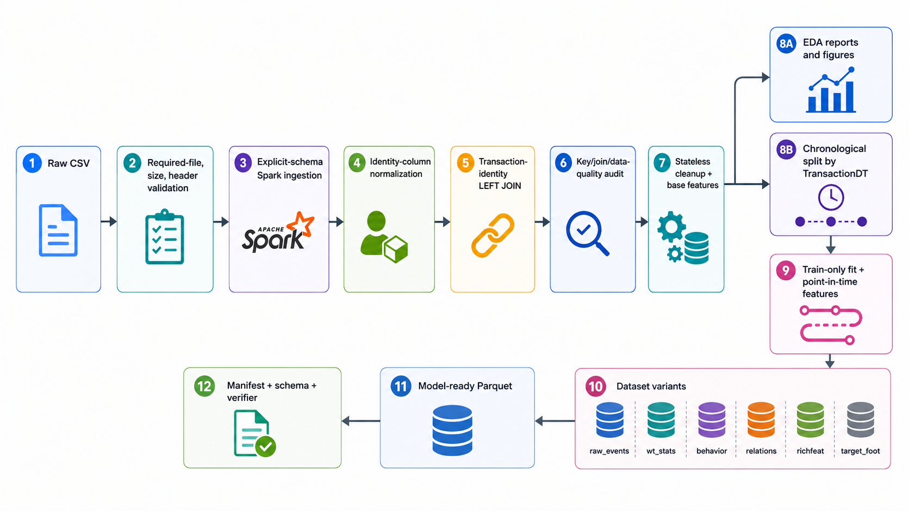
</p>

### 💧 Leakage-Controlled Transformation Flow

<p align="center">
  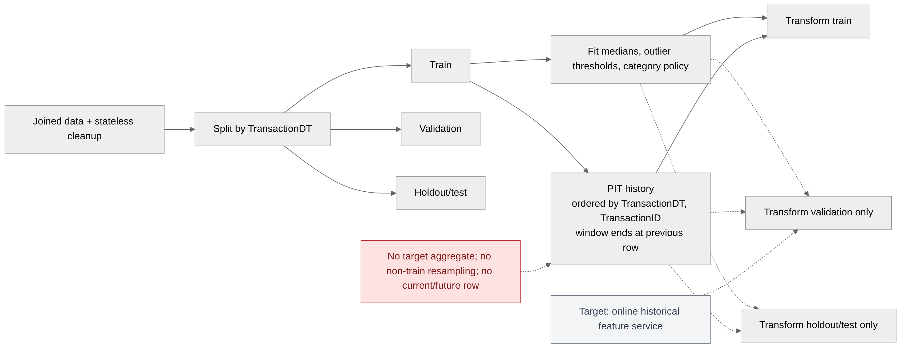
</p>

- **Raw Ingestion**: Joins `train_transaction.csv` (590,540 rows) and `train_identity.csv` (144,233 rows) on `TransactionID`.
- **Temporal Splitting**: Splits datasets sequentially by `TransactionDT` to guarantee zero future-data leakage:
  - **Training Split**: 412,956 rows (first 70% of timeline)
  - **Validation Split**: 88,486 rows (next 15% of timeline)
  - **Holdout Split**: 89,098 rows (final 15% of timeline)
- **Feature Engineering (68 Canonical Features)**:
  - **Numeric Features (61)**: Transaction amount transformations, log amounts, card/account history, aggregated missingness counters, anonymized behavior counters (`C1–C14`, `D1–D15`), distance metrics (`dist1`, `dist2`).
  - **Categorical Features (7)**: `ProductCD`, `card4`, `card6`, `DeviceType`, `device_family`, `M4`, `amount_band`.

### 📜 Data, Feature & Evaluation Contracts

<p align="center">
  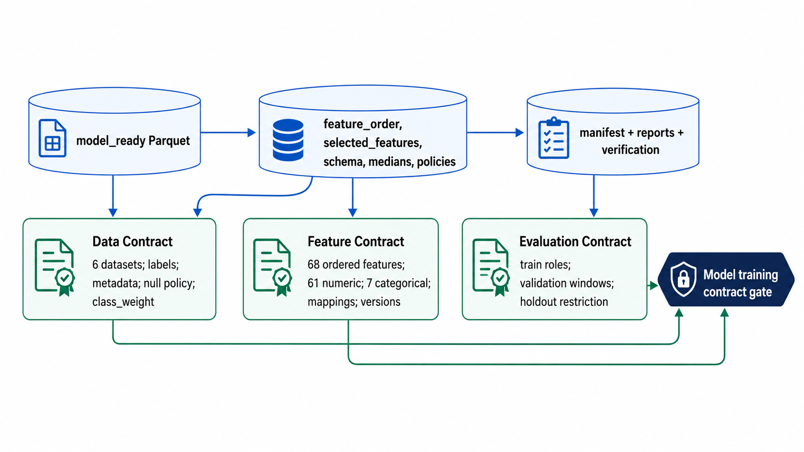
</p>

- **Manifest & Checksums**: Every pipeline run outputs `manifest.json`, `feature_order.json`, and `verification_report.json` with SHA-256 integrity hashes.
- **Contract Verifier**: `verify_processed_data.py` executes **94 automated schema and statistical checks** prior to downstream training.

---

## 📈 Exploratory Data Analysis (EDA) Insights

<p align="center">
  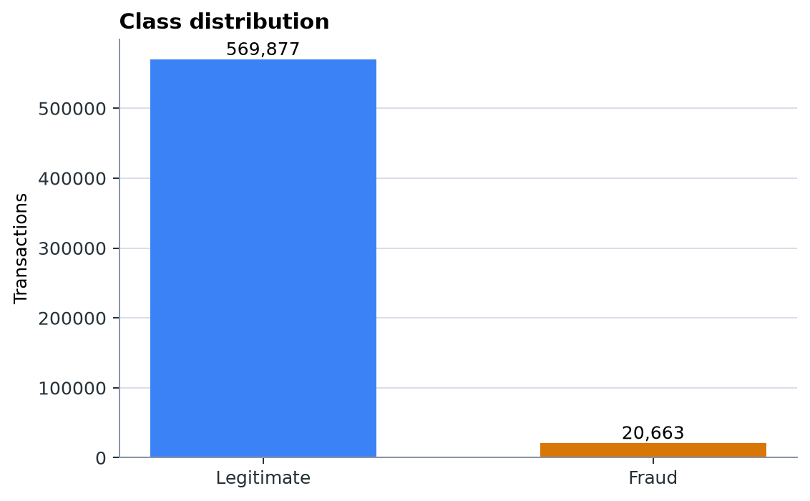
  &nbsp; &nbsp;
  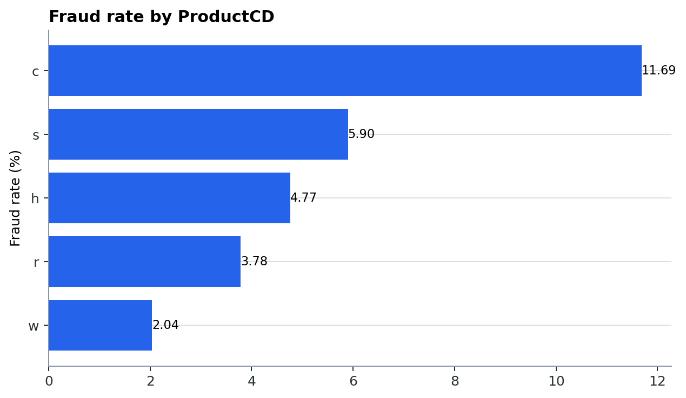
</p>

<p align="center">
  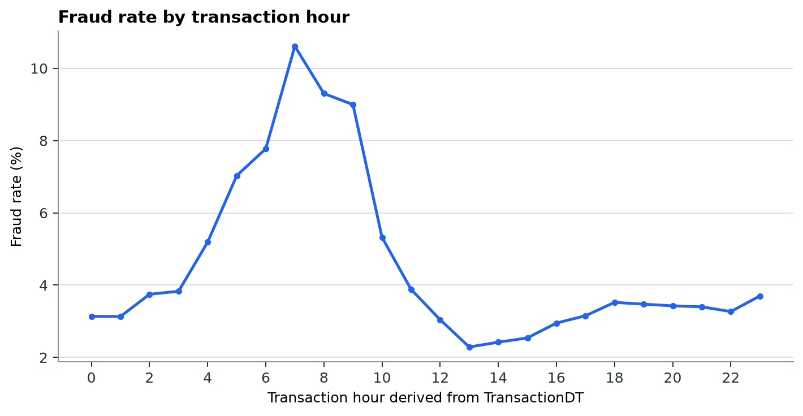
</p>

- **Extreme Class Imbalance**: Fraud transactions account for only **3.50%** of total dataset volume (20,663 positive fraud cases vs 569,877 legitimate transactions).
- **Product Code Association**: Product category `C` exhibits the highest fraud concentration (> 11%), while category `W` has the highest absolute transaction volume.
- **Temporal Cycles**: Fraud activity spikes during early morning hours (03:00–06:00 UTC) when legitimate transaction volume is lowest.

---

## 🧠 Model Development & Machine Learning Pipeline

<p align="center">
  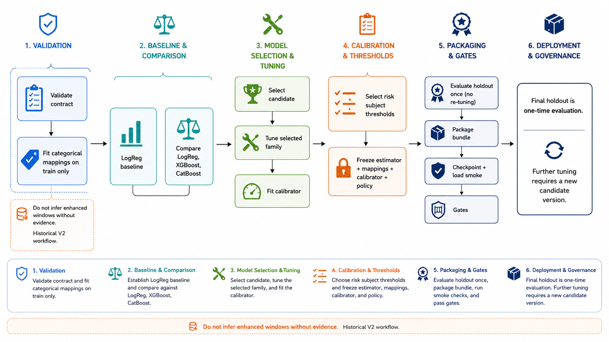
</p>

### 🏆 Model Family Comparison

<p align="center">
  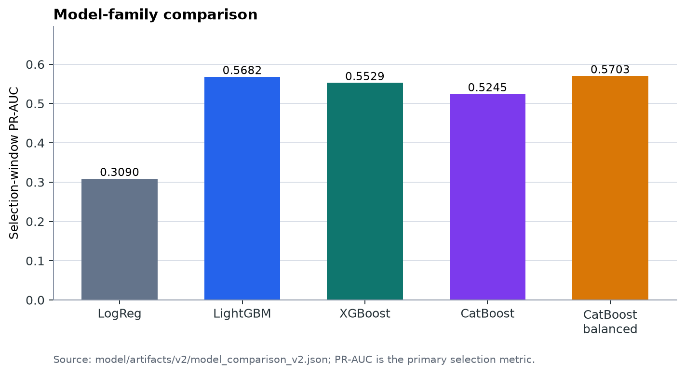
</p>

| Model Family | Training Variant | Validation ROC-AUC | Validation PR-AUC | Selection Decision |
|---|---|---:|---:|---|
| **Logistic Regression** | Weighted | `0.8219` | `0.3090` | Baseline |
| **LightGBM** | Weighted | `0.9116` | `0.5682` | Compared |
| **XGBoost** | Weighted | `0.8879` | `0.5529` | Compared |
| **CatBoost** | Weighted | `0.8757` | `0.5245` | Compared |
| **CatBoost (Selected)** | **Balanced** | **`0.9070`** | **`0.5703`** | **Selected Candidate** |

### 🎯 Calibration & Holdout Evaluation

<p align="center">
  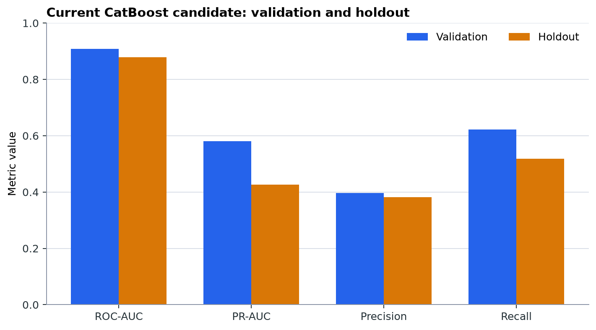
  &nbsp; &nbsp;
  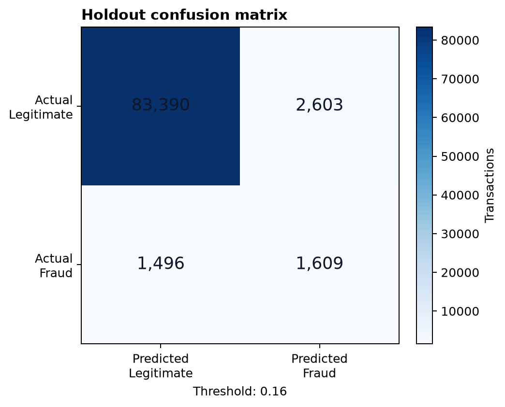
</p>

<p align="center">
  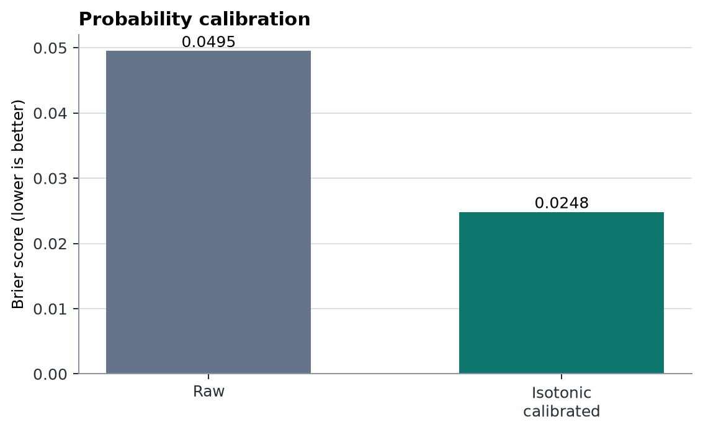
</p>

- **Isotonic Calibration**: Reduces Brier score from `0.0495` (raw) to `0.0248` (calibrated) on holdout data, ensuring predicted probabilities reflect true empirical risk.
- **Operating Confusion Matrix** (At threshold 0.16):
  - **True Positives (TP)**: `1,609` | **False Positives (FP)**: `2,603`
  - **True Negatives (TN)**: `83,390` | **False Negatives (FN)**: `1,496`

### 🚦 Automated Promotion Gate

<p align="center">
  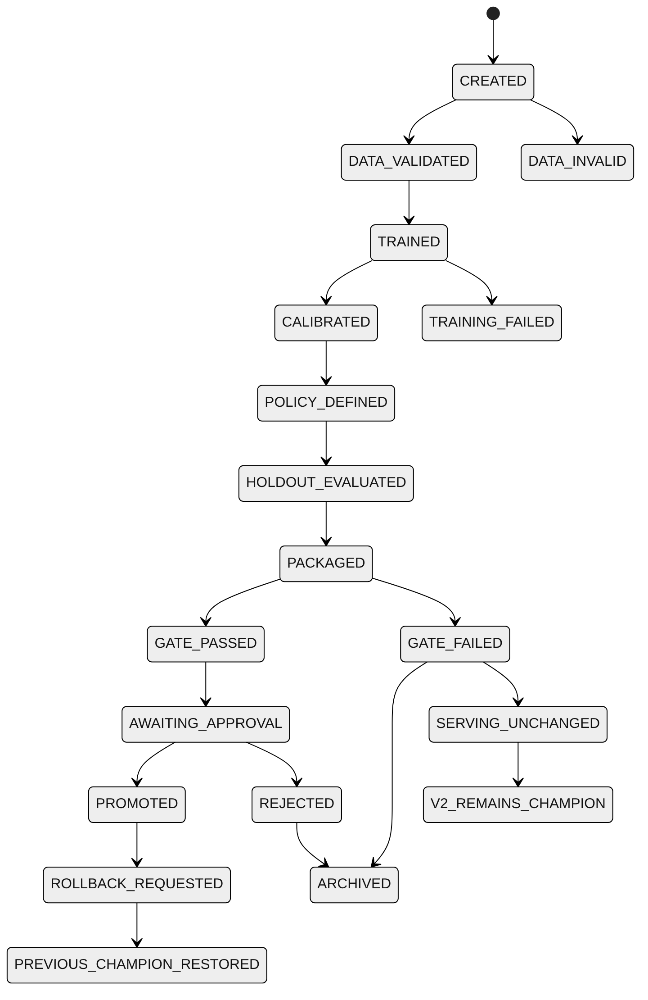
</p>

---

## 🖥️ Operational Dashboard & User Interface

### 📋 Transaction Monitoring Queue
Filter, search, and sort incoming transactions by risk band, score, and timestamp.
<p align="center">
  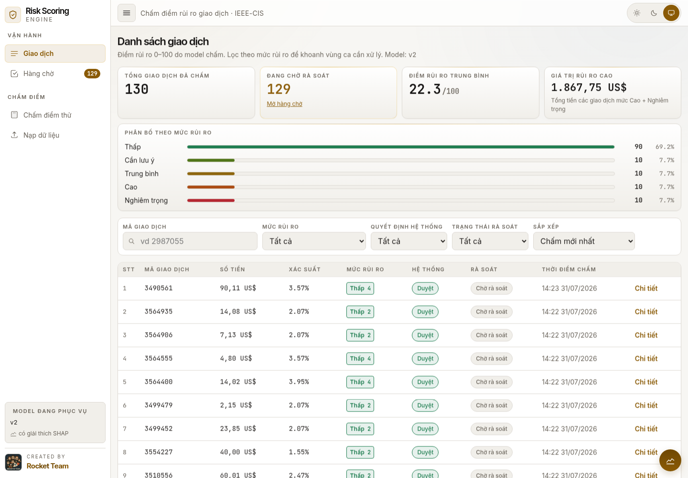
</p>

### 🎯 Real-Time Scoring & SHAP Feature Attributions
View breakdown of risk score (0–100), risk band classification, and top 5 TreeSHAP contribution factors.
<p align="center">
  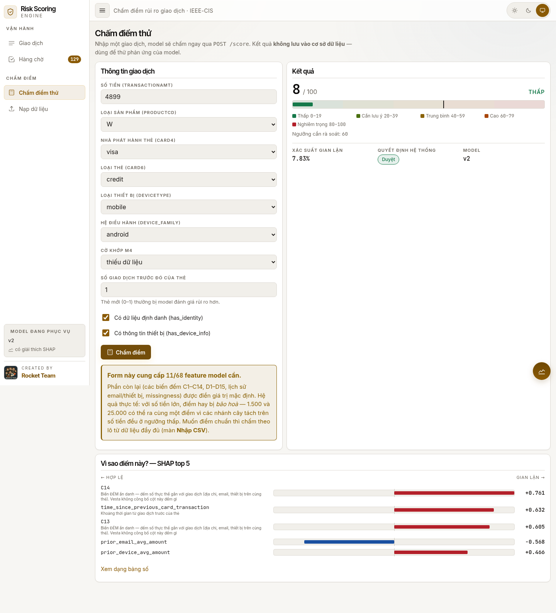
</p>

### 🔎 Detailed Transaction Inspection
Inspect raw attribute values, card details, email domains, and device metadata.
<p align="center">
  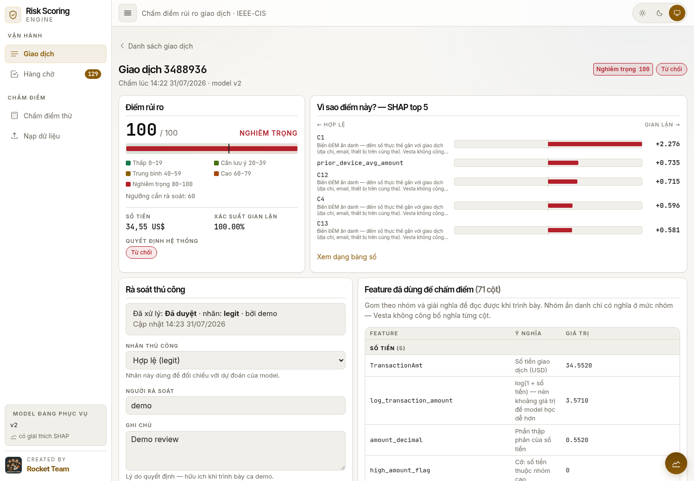
</p>

### ✅ Human Analyst Fraud Review Workflow
Submit manual review decisions (`Approve` / `Reject`) with notes to update transaction state.
<p align="center">
  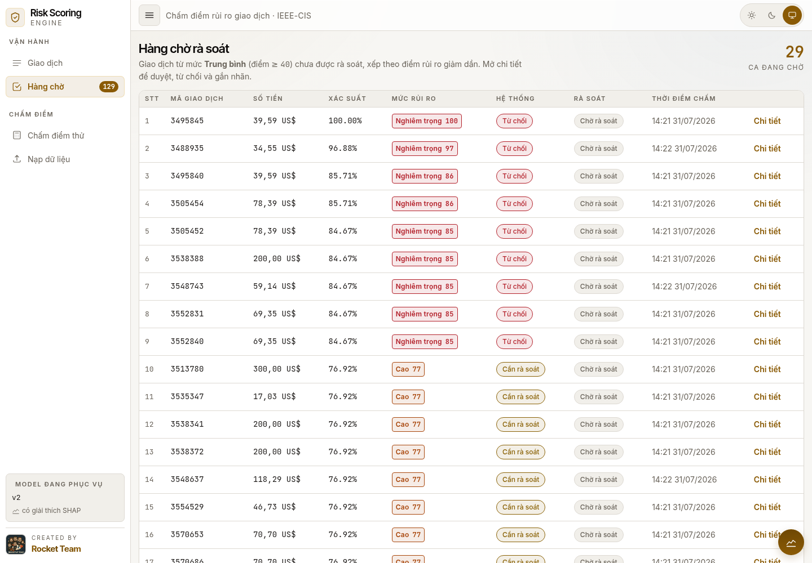
</p>

### 📖 Interactive Swagger API Documentation
<p align="center">
  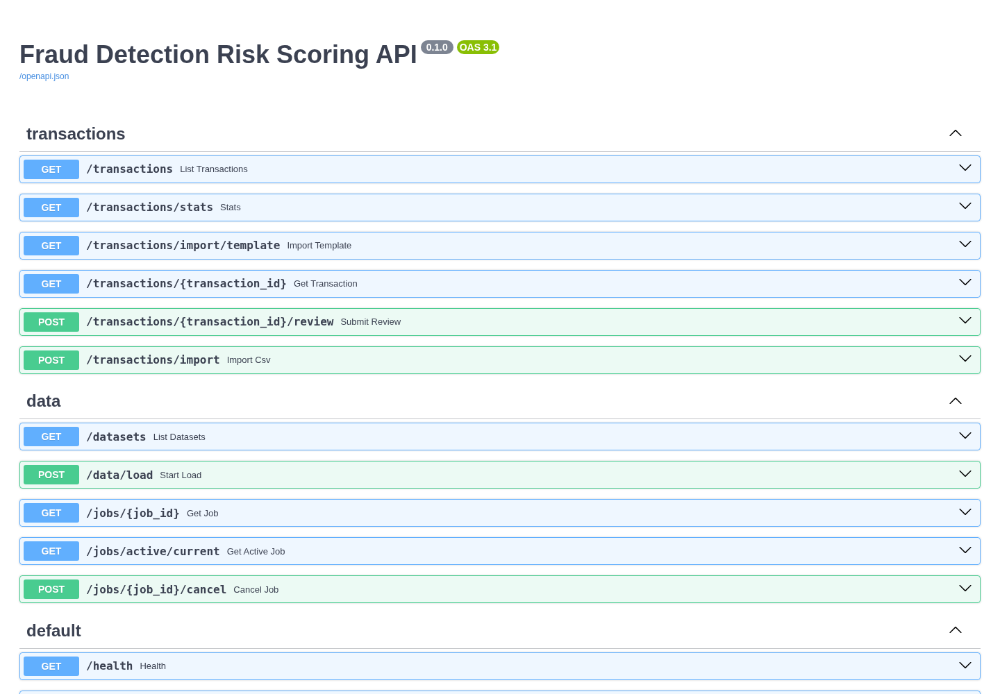
</p>

---

## 🐳 Deployment & Container Architecture

<p align="center">
  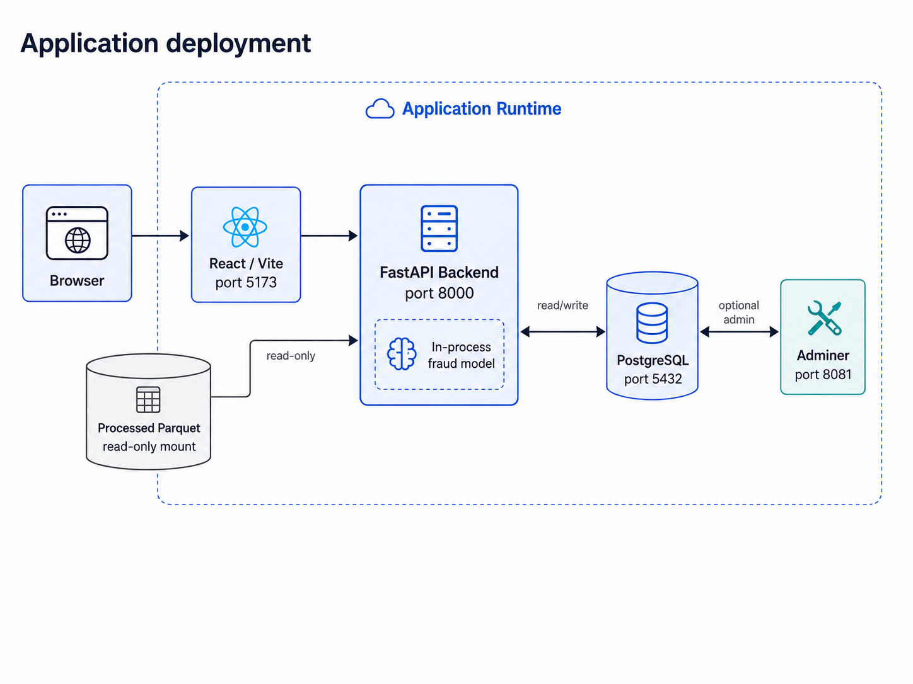
</p>

The entire platform is containerized using Multi-Stage Docker builds:

| Container | Base Image | Port | Description |
|---|---|---|---|
| 🖥️ **frontend** | Node 20 / Nginx | `5173` | React SPA dashboard serving built static assets. |
| ⚡ **backend** | Python 3.11-slim | `8000` | FastAPI app importing `fraud_model` for local in-process scoring. |
| 🗃️ **db** | PostgreSQL 16 | `5432` | Relational store for transaction records, scores, and analyst reviews. |
| 🔧 **adminer** (optional) | Adminer | `8081` | Web-based database management interface. |

---

## 📁 Repository Directory Structure

```
📦 Fraud-Detection-Score-Risk
├── ⚡ backend/                     → FastAPI application service
│   ├── Dockerfile                 → Multi-stage Python build
│   ├── pyproject.toml             → Dependencies managed via uv
│   └── src/fraud_backend/         → API routers, database models, risk policy
├── 🖥️ frontend/                   → React + TypeScript dashboard
│   ├── src/                       → UI components, hooks, state management
│   └── package.json               → Vite, Tailwind CSS, Lucide icons
├── 🧠 model/                      → Machine Learning submodule
│   ├── artifacts/                 → Serialized models, manifests, checksums
│   │   └── v2/                    → Official V2 candidate bundle
│   └── src/fraud_model/           → Training, evaluation, calibration & SHAP logic
├── 🔄 pipeline/                   → Data contract verification & schema hashes
├── 📊 data/                       → Data pipeline scripts & Parquet specifications
│   └── ieee_cis/pipeline/         → PySpark ETL, feature engineering, temporal splitting
├── 📚 docs/                       → Architectural diagrams, reports & thesis LaTeX
│   ├── diagrams/final/            → Vector SVG & high-res PNG diagrams
│   ├── figures/final_report/      → EDA charts & model evaluation plots
│   └── latex/                     → LaTeX source code for 28-page report
├── 🛠️ scripts/                    → Automation shell scripts & CLI helpers
├── 🐳 docker-compose.yml          → Full application stack compose file
└── 🐳 docker-compose.preprocessing.yml → Spark preprocessing compose file
```

---

## 🚀 Quick Start Guide

### Prerequisites
- 🐳 **Docker & Docker Compose** (v2.20+)
- 📦 **IEEE-CIS Dataset**: Download raw CSV files into `data/data/ieee-fraud-detection/`

### 1️⃣ Run Data Preprocessing (Spark)

```bash
docker compose -f docker-compose.preprocessing.yml build
docker compose -f docker-compose.preprocessing.yml run --rm preprocess
docker compose -f docker-compose.preprocessing.yml run --rm verify-processed
```

### 2️⃣ Execute Official End-to-End Workflow

```bash
bash scripts/run_official_full.sh
```

### 3️⃣ Launch Full Application Stack

```bash
docker compose up --build
```

Access services:
- 🖥️ **Dashboard**: [http://localhost:5173](http://localhost:5173)
- ⚡ **Swagger API Docs**: [http://localhost:8000/docs](http://localhost:8000/docs)
- 🔧 **Adminer Database UI**: `docker compose --profile tools up -d adminer` → [http://localhost:8081](http://localhost:8081)

---

## 🔮 Future Work & Engineering Roadmap

To advance the platform toward enterprise-grade production deployment, five key engineering and research directions are identified:

1. ⚡ **Real-Time Feature Store (Online-Offline Parity)**: Implement a low-latency online feature store (e.g., Feast or Redis-backed stream processing engine) to calculate streaming aggregations (e.g., rolling 1-hour transaction counts per card) with sub-10ms latency.
2. 🎛️ **Decoupled Dynamic Policy Engine**: Separate operational risk decisions (`approve`, `review`, `reject`) from offline model weights, enabling compliance risk officers to dynamically adjust decision boundaries without redeploying model artifacts.
3. 📉 **Continuous MLOps & Drift Monitoring**: Deploy automated tracking for Population Stability Index (PSI) and Kolmogorov-Smirnov prediction drift to automatically trigger CI/CD retraining pipelines when metrics drop below SLA bounds.
4. 🕸️ **Graph Neural Networks & Temporal Transformers**: Incorporate Graph Neural Networks (GNNs) on transaction-user-device bipartite graphs to capture complex fraud rings/syndicates, alongside temporal Transformer architectures.
5. 🔍 **Actionable Counterfactual Recourse**: Extend TreeSHAP attributions with actionable counterfactual recourse explanations for risk analysts to identify minimal feature shifts needed for decision overrides.

---

## 👥 Team Roster & Subsystem Ownership

| Member | Official Role | Primary Subsystem Ownership |
|---|---|---|
| 👨‍💼 **TUYEN Le Quang** | Project Leader | Overall project ideation, management, thesis narrative. |
| 🔧 **AN Duong Binh** | Big Data & Pipeline Engineer | Spark ingestion, temporal splitting, 68-feature engineering, data contracts. |
| 🧠 **LONG Pham Duc** | Machine Learning Engineer | Model comparison, hyperparameter tuning, isotonic calibration, holdout evaluation. |
| ⚙️ **TRUNG Do Quoc** | Backend & API Engineer | FastAPI backend, PostgreSQL schema, Docker compose setup, REST contracts. |
| 🖥️ **QUAN Duong Hong** | Frontend & UI Engineer | React dashboard, SHAP charts, transaction queue, review workflow. |
| 📝 **NHI Nguyen Le Hong** | Content & Presentation Coordinator | Content synthesis, slide design, presentation strategy. |

**🎓 Project Supervisor**: TAN Le Duy

---

## 📄 License & Attribution

Developed as part of the **BDA501 Capstone Project** at **FPT University**.
All rights reserved by **RocketUpTeam** © 2026.
