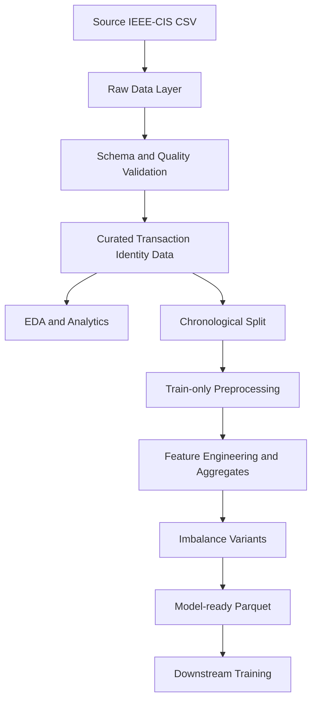

# Apache Spark Data Architecture and Processing Pipeline for IEEE-CIS Fraud Detection

## 1. Introduction

Bài toán Fraud Detection đòi hỏi nhiều hơn một mô hình phân loại. Chất lượng của dự đoán phụ thuộc trực tiếp vào cách dữ liệu được khám phá, kiểm định, làm sạch, biến đổi và chuẩn bị trước khi đi vào bước huấn luyện. Với bộ IEEE-CIS Fraud Detection, phần Data Processing đặc biệt quan trọng vì dữ liệu có kích thước lớn, bị tách thành transaction và identity, có missingness rất cao ở nhiều cột, mất cân bằng lớp mạnh và có rủi ro temporal leakage nếu chia dữ liệu không đúng.

Phần việc của An trong project này tập trung vào việc xây dựng một batch pipeline bằng Apache Spark để chuyển dữ liệu thô từ raw CSV sang model-ready Parquet có thể tái sử dụng cho downstream model training. Báo cáo này chỉ tập trung vào phần Data Processing and EDA đó, không đi sâu vào backend, frontend, API hay model serving.

Phạm vi báo cáo bao gồm:

- raw-data discovery;
- dataset validation;
- typed Spark ingestion;
- explicit schema;
- train/test identity-column normalization;
- transaction-identity join;
- data-quality audit;
- missingness profiling;
- outlier profiling and transformation;
- distributed EDA;
- chronological split;
- leakage prevention;
- feature engineering;
- historical aggregates theo card, email và device;
- class-imbalance handling;
- model-ready Parquet export;
- data handover cho downstream training.

## 2. Project and Dataset Overview

Project: Fraud Detection / Fraud Risk Scoring  
Học phần: BDA501  
Dataset: IEEE-CIS Fraud Detection

Theo `data/processed/ieee_cis_fraud_risk/reports/dataset_inventory.csv`, pipeline làm việc với 4 file chính của competition và 1 file phụ `sample_submission.csv`. Dữ liệu được đặt tại `data/data/ieee-fraud-detection/` và được truy vết bởi `pipeline/fraud_risk_data_pipeline.py` cùng `data/ieee_cis/pipeline/ieee_cis_preprocess.py`.

`isFraud` là target chỉ xuất hiện trong `train_transaction.csv`. `TransactionID` là khóa join giữa transaction và identity. `TransactionDT` được dùng như relative transaction time; nó không được diễn giải là Unix timestamp thực, mà chỉ dùng để bảo toàn thứ tự thời gian và xây dựng temporal features.

| Dataset | Rows | Columns | Size | Label |
| --- | ---: | ---: | ---: | --- |
| train_transaction.csv | 590,540 | 394 | 651.69 MB | Có `isFraud` |
| train_identity.csv | 144,233 | 41 | 25.30 MB | Không |
| test_transaction.csv | 506,691 | 393 | 584.79 MB | Không |
| test_identity.csv | 141,907 | 41 | 24.60 MB | Không |

Tổng kích thước 4 file chính là hơn 1.28 GB; nếu tính cả `sample_submission.csv` thì inventory ghi nhận tổng source size là 1,292.18 MB. Điều này vượt xa ngưỡng 500 MB thường dùng để chứng minh nhu cầu xử lý Big Data trong BDA501.

## 3. Data Challenges

Dữ liệu IEEE-CIS đặt ra các thách thức rõ ràng:

- dataset lớn hơn 500 MB, không phù hợp với quy trình full-data Pandas đơn giản;
- số chiều cao: chỉ riêng transaction đã có 393–394 cột;
- transaction và identity được lưu tách rời, bắt buộc phải join đúng grain theo `TransactionID`;
- missingness rất cao ở nhiều cột identity và behavioral columns;
- class imbalance mạnh: fraud chỉ khoảng 3.5%;
- nhiều categorical fields có cardinality cao;
- nhiều cột `C*`, `D*`, `M*`, `dist*` là anonymized features;
- `TransactionDT` mang yếu tố thời gian, tạo rủi ro leakage nếu random split;
- historical aggregates rất dễ vô tình dùng future information nếu không kiểm soát đúng thứ tự.

Các thách thức này giải thích vì sao phần Data Processing phải được thiết kế như một pipeline có thứ tự biến đổi rõ ràng, có artifact lưu lại, thay vì chỉ là notebook EDA rời rạc.

## 4. Why Apache Spark

Apache Spark được chọn vì nó phù hợp trực tiếp với tính chất dữ liệu và các thao tác cần thực hiện:

- Spark DataFrame API cho phép làm việc với dữ liệu có schema rõ ràng;
- lazy evaluation giúp tối ưu plan cho các bước lọc, join, aggregation;
- Spark SQL và `groupBy`/`agg` phù hợp cho EDA phân tán;
- Window operations cần thiết cho historical aggregates và velocity-style features;
- `approxQuantile` phù hợp để xử lý quantile/outlier trên dữ liệu lớn;
- MLlib đáp ứng phần baseline model của BDA501;
- Parquet là định dạng columnar phù hợp cho handover downstream;
- pipeline có thể chạy local Spark hoặc đóng gói sang Docker Linux mà không phải viết lại logic.

Trong implementation thực tế:

- Spark được dùng cho raw ingestion, join, audit, EDA aggregations, feature engineering, chronological split, aggregate fitting và Parquet export;
- Pandas chỉ được dùng cho report nhỏ, plotting sau khi dữ liệu đã aggregate nhỏ, hoặc export CSV bounded.

Điều này phù hợp với mục tiêu “Spark xử lý raw/large data, Pandas chỉ xử lý aggregated small outputs”.

## 5. Data Architecture

Pipeline dữ liệu có thể được tái dựng thành các layer sau.

| Layer | Input | Processing | Output |
| --- | --- | --- | --- |
| Source Layer | IEEE-CIS competition files | file discovery | raw file paths |
| Raw Data Layer | CSV gốc | typed Spark ingestion | raw Spark DataFrames |
| Validation Layer | raw Spark DataFrames | key checks, size checks, schema checks | validated raw datasets |
| Curated Data Layer | transaction + identity | column normalization, left join, cleanup | `curated/train_joined`, `curated/test_joined`, cleaned datasets |
| Analytics Layer | curated train | EDA, profiling, groupBy/agg, plots | `reports/`, `reports/eda/`, `reports/figures/` |
| Feature Engineering Layer | cleaned + split data | time/amount/missingness/entity features, train-only aggregates | split-specific feature tables |
| Model-Ready Layer | engineered features | imputation, categorical normalization, imbalance variants | `model_ready/*` Parquet |
| Handover Layer | model-ready data + artifacts | schema/version contract, manifest, verifier | downstream training handover |



Kiến trúc này phản ánh đúng các output directories thực tế trong `data/processed/ieee_cis_fraud_risk/`.

## 6. Pipeline Overview

End-to-end pipeline của An có thể mô tả như sau:

Raw Files  
→ Validation  
→ Typed Spark Ingestion  
→ Schema Normalization  
→ Transaction–Identity Join  
→ Quality Audit  
→ EDA  
→ Cleaning  
→ Chronological Split  
→ Train-only Fitting  
→ Feature Engineering  
→ Aggregate Features  
→ Imbalance Handling  
→ Model-Ready Export

Ý nghĩa của từng stage:

1. Raw file discovery  
   - Input: thư mục raw IEEE-CIS  
   - Transformation: tìm đúng 4 file bắt buộc  
   - Output: validated source paths  
   - Purpose: tránh hard-coded single path

2. Typed Spark ingestion  
   - Input: raw CSV  
   - Transformation: đọc bằng explicit Spark schema  
   - Output: transaction/identity DataFrames  
   - Purpose: tránh infer schema mù

3. Identity normalization  
   - Input: identity headers  
   - Transformation: `id-01 -> id_01`  
   - Output: train/test identity schema tương thích  
   - Purpose: thống nhất train/test

4. Join  
   - Input: transaction + identity  
   - Transformation: left join theo `TransactionID`  
   - Output: joined datasets  
   - Purpose: giữ nguyên grain transaction

5. Audit and profiling  
   - Input: joined/raw datasets  
   - Transformation: row/key/missingness/class audits  
   - Output: report CSV/JSON  
   - Purpose: giải thích chất lượng dữ liệu

6. Cleaning and base feature creation  
   - Input: joined data  
   - Transformation: categorical normalization, time features, presence flags  
   - Output: cleaned datasets  
   - Purpose: chuẩn hóa đầu vào trước split

7. Chronological split  
   - Input: cleaned labeled train  
   - Transformation: 70/15/15 bằng `TransactionDT` quantiles  
   - Output: train/validation/holdout  
   - Purpose: chống temporal leakage

8. Train-only fit and transform  
   - Input: split datasets  
   - Transformation: median imputation, outlier thresholds, aggregate fitting  
   - Output: model-ready features  
   - Purpose: transform validation/holdout/test mà không leakage

9. Imbalance handling  
   - Input: train split  
   - Transformation: class weight, undersampling  
   - Output: `train_original`, `train_weighted`, `train_balanced`  
   - Purpose: hỗ trợ nhiều training strategy

10. Model-ready export  
    - Input: engineered datasets  
    - Transformation: Parquet export + metadata columns  
    - Output: 6 model-ready datasets  
    - Purpose: downstream model training dùng lại trực tiếp

## 7. Data Ingestion Method

Root entrypoint của pipeline là `pipeline/fraud_risk_data_pipeline.py`. File này đọc `config/pipeline_config.yaml`, nhận CLI arguments và set environment variables để gọi implementation Spark chính trong `data/ieee_cis/pipeline/ieee_cis_preprocess.py`.

Về data ingestion, pipeline thực hiện:

- file discovery từ nhiều candidate paths;
- required-file validation cho 4 file bắt buộc;
- total-size calculation;
- explicit schema construction từ header;
- typed Spark read với `.schema(...)`;
- inventory output cho từng file.

Lý do không dùng full-data Pandas:

- `train_transaction.csv` và `test_transaction.csv` đã gần 1.24 GB tổng cộng;
- downstream còn cần join, profiling, `approxQuantile`, Window aggregates và Parquet export;
- Spark giữ được execution model phân tán và nhất quán hơn cho toàn bộ pipeline.

## 8. Schema Normalization

Một bước quan trọng là thống nhất schema giữa train và test identity. Pipeline normalize các cột kiểu `id-01` sang `id_01` bằng `normalize_identity_columns(...)`. Đây là bước cần thiết để train/test cùng một feature family có cùng tên.

Schema raw được lưu thành artifact tại:

- `artifacts/schema/raw_train_transaction_schema.json`
- `artifacts/schema/raw_train_identity_schema.json`
- `artifacts/schema/raw_test_transaction_schema.json`
- `artifacts/schema/raw_test_identity_schema.json`

Ví dụ schema mẫu:

| Column | Source Type | Spark Type | Purpose |
| --- | --- | --- | --- |
| `TransactionID` | integer-like key | `bigint` | join key |
| `isFraud` | binary label | `int` | training target |
| `TransactionDT` | relative time | `bigint` | temporal split + time features |
| `TransactionAmt` | numeric amount | `double` | amount features |
| `ProductCD` | categorical | `string` | category feature |
| `dist1`, `dist2` | numeric distance | `double` | distance features |
| `id_12`, `id_15`, `id_16` | identity categorical | `string` | identity fields |
| `id_01`, `id_02`, ... | identity numeric | `double` | identity fields |
| `DeviceType`, `DeviceInfo` | categorical | `string` | device features |

Theo artifact, train transaction có 394 cột, test transaction có 393 cột; train/test identity đều có 41 cột sau normalization.

## 9. Transaction–Identity Join

Join key là `TransactionID`. Join type là left join, được triển khai bởi `left_join_with_identity(...)`.

Lý do chọn left join:

- grain chính của pipeline là transaction;
- không phải mọi transaction đều có identity row;
- dropping unmatched transactions sẽ làm thay đổi population của bài toán fraud detection.

Số liệu thực từ `reports/join_audit.csv`:

| Dataset | Transaction Rows | Identity Rows | Matched | Joined Rows |
| --- | ---: | ---: | ---: | ---: |
| train | 590,540 | 144,233 | 144,233 | 590,540 |
| test | 506,691 | 141,907 | 141,907 | 506,691 |

Như vậy:

- row count sau join được giữ nguyên;
- không có row multiplication;
- train có 446,307 transaction không có identity;
- test có 364,784 transaction không có identity.

Identity coverage ratio trong `reports/data_quality_summary.csv`:

- joined_train: 0.244239
- joined_test: 0.280066

Pipeline cũng tạo feature `has_identity` để giữ lại thông tin presence này như một signal thay vì xem nó chỉ là missingness thuần túy.

## 10. Data Quality Methodology

Phần Data Quality hiện thực sự có trong code và artifact bao gồm:

- primary key check cho `TransactionID`;
- null key check;
- duplicate key check;
- row count audit;
- identity coverage audit;
- null `TransactionAmt` check;
- empty `ProductCD` check.

Theo `reports/duplicate_summary.csv`:

- duplicate `TransactionID`: 0 cho cả 4 dataset
- null `TransactionID`: 0 cho cả 4 dataset

Theo `reports/invalid_records_summary.csv`:

- null `TransactionAmt`: 0 ở train/test transaction
- empty `ProductCD`: 0 ở train/test transaction

Report hiện có không chứng minh exact duplicate row removal hoặc malformed row quarantine trên quy mô lớn; vì vậy báo cáo này không khẳng định các xử lý đó nếu artifact không cho thấy.

## 11. Exploratory Data Analysis Methodology

EDA được triển khai bằng Spark aggregations và Spark-friendly operations, sau đó mới materialize report nhỏ.

Các phân tích chính bao gồm:

- class distribution và fraud rate;
- amount statistics;
- fraud by `ProductCD`;
- fraud by `card4`, `card6`;
- fraud by `P_emaildomain`, `R_emaildomain`;
- fraud by `DeviceType` / `device_family`;
- fraud by hour/day/week;
- fraud by amount band;
- fraud by `has_identity`;
- fraud by missing-ratio bucket;
- top card/email/device entities;
- top fraud-rate entities với minimum support;
- numeric correlations trên sample nhỏ.

Các Spark operations được dùng:

- `groupBy`
- `agg`
- `orderBy`
- `Window`
- `approxQuantile`
- Spark SQL/DataFrame transformations

Điểm quan trọng là pipeline không collect raw dataset lớn về driver để vẽ biểu đồ; chỉ các aggregated outputs nhỏ mới được chuyển sang Pandas/Matplotlib.

## 12. EDA Findings

### Insight 1: Fraud rate tổng thể thấp nhưng không cực hiếm

- Evidence: `reports/eda/fraud_overview.csv`
- Quantitative result: 590,540 transactions; 20,663 fraud; fraud rate 3.499001%
- Interpretation: đây là dữ liệu mất cân bằng rõ rệt nhưng fraud vẫn đủ lớn để xây dựng weighted và undersampled training variants.
- Effect on pipeline or feature engineering: pipeline tạo `train_weighted` và `train_balanced`, thay vì chỉ train trên distribution gốc.

### Insight 2: Product category C có fraud rate vượt trội

- Evidence: `reports/eda/fraud_by_product.csv`
- Quantitative result: `ProductCD = c` có 68,519 transactions với fraud rate 11.687269%, trong khi `ProductCD = w` có 439,670 transactions nhưng fraud rate chỉ 2.039939%
- Interpretation: product type là một categorical signal mạnh; một số product groups mang risk profile rất khác nhau.
- Effect on pipeline or feature engineering: `ProductCD` được giữ trong canonical categorical feature set và không bị loại khỏi model-ready data.

### Insight 3: Payment method credit rủi ro cao hơn debit

- Evidence: `reports/eda/fraud_by_card6.csv`
- Quantitative result: `credit` có 148,986 transactions với fraud rate 6.678480%; `debit` có 439,938 transactions với fraud rate 2.426251%
- Interpretation: card funding type có signal phân biệt fraud khá rõ.
- Effect on pipeline or feature engineering: `card6` được giữ làm categorical feature; đồng thời historical aggregates theo card được bổ sung để mô tả behavior theo entity chứ không chỉ theo category.

### Insight 4: Identity presence liên quan mạnh tới fraud

- Evidence: `reports/eda/fraud_by_has_identity.csv`
- Quantitative result: `has_identity = 1` có fraud rate 7.847025%; `has_identity = 0` chỉ 2.093850%
- Interpretation: việc có identity record không chỉ là vấn đề completeness mà còn là behavioral signal.
- Effect on pipeline or feature engineering: `has_identity`, `identity_missing_count` và `identity_missing_ratio` được tạo như feature riêng.

### Insight 5: Fraud tập trung mạnh hơn ở một số khung giờ sáng sớm

- Evidence: `reports/eda/fraud_by_hour.csv`
- Quantitative result: hour 7 có fraud rate 10.610151%; hour 8 là 9.301428%; hour 13 chỉ 2.288949%
- Interpretation: temporal behavior có ý nghĩa, và pattern gian lận thay đổi theo thời điểm tương đối trong ngày.
- Effect on pipeline or feature engineering: pipeline giữ `transaction_hour`, `transaction_day`, `transaction_week`, `transaction_day_of_week_proxy` và `is_night_transaction`.

### Insight 6: Amount bands ở đầu nhỏ và khoảng 250–1000 có fraud rate cao hơn trung tâm

- Evidence: `reports/eda/fraud_by_amount_band.csv`
- Quantitative result: `00_0_10` có fraud rate 7.765998%; `01_10_25` là 5.911628%; `05_250_500` là 5.366887%; trong khi `03_50_100` chỉ 2.917822%
- Interpretation: amount distribution không đơn điệu; cả low-value và một số mid-high bands đều có signal riêng.
- Effect on pipeline or feature engineering: pipeline tạo `log_transaction_amount`, `transaction_amount_capped`, `amount_band`, `high_amount_flag` và `amount_outlier_flag` thay vì chỉ dùng `TransactionAmt` thô.

### Insight 7: Fraud amount cao hơn non-fraud ở cả mean và median

- Evidence: `reports/eda/transaction_amount_by_class.csv`
- Quantitative result: non-fraud average 134.511665 và median 68.5; fraud average 149.244779 và median 75.0
- Interpretation: amount có signal thực, nhưng signal không đủ đơn giản để chỉ dùng một threshold cố định.
- Effect on pipeline or feature engineering: amount được transform nhiều dạng thay vì one-dimensional cut-off.

### Insight 8: Một số device groups có fraud rate rất cao

- Evidence: `reports/eda/fraud_by_device.csv`
- Quantitative result: `desktop|android` fraud rate 28.804348% nhưng chỉ 184 transactions; `mobile|other` 12.857559% với 24,017 transactions; `__missing__|other` chỉ 2.101715% với 449,728 transactions
- Interpretation: device signal mạnh nhưng support không đồng đều; cần phân biệt rare-high-risk với high-support groups.
- Effect on pipeline or feature engineering: pipeline giữ `DeviceType`, chuẩn hóa `device_family` và thêm device-level historical aggregates.

Các bảng EDA chính:

Class distribution:

| Metric | Value |
| --- | ---: |
| Transactions | 590,540 |
| Fraud | 20,663 |
| Fraud rate | 3.499001% |
| Legitimate-to-fraud ratio | 27.5795867 |

Fraud by product:

| ProductCD | Transactions | Fraud Rate % |
| --- | ---: | ---: |
| c | 68,519 | 11.687269 |
| s | 11,628 | 5.899553 |
| h | 33,024 | 4.766231 |
| r | 37,699 | 3.782594 |
| w | 439,670 | 2.039939 |

Fraud by payment type:

| card6 | Transactions | Fraud Rate % |
| --- | ---: | ---: |
| credit | 148,986 | 6.678480 |
| debit | 439,938 | 2.426251 |

Fraud by time:

| Hour | Transactions | Fraud Rate % |
| --- | ---: | ---: |
| 5 | 9,701 | 7.030203 |
| 6 | 6,007 | 7.774263 |
| 7 | 3,704 | 10.610151 |
| 8 | 2,591 | 9.301428 |
| 13 | 20,315 | 2.288949 |

Missingness / identity relationship:

| Group | Transactions | Fraud Rate % |
| --- | ---: | ---: |
| has_identity = 0 | 446,307 | 2.093850 |
| has_identity = 1 | 144,233 | 7.847025 |

## 13. Missing-Value Methodology

Missingness được tính và ghi lại trong `reports/missingness_profile.csv` và `reports/missingness_strategy.csv`. Pipeline phân loại theo 4 mức:

| Missing Level | Threshold | Method | Reason |
| --- | --- | --- | --- |
| Low | < 20% | keep + impute/fill | mất ít thông tin |
| Medium | 20% đến < 70% | keep + transform | vẫn có signal |
| High | 70% đến < 95% | keep có chọn lọc, theo dõi rõ | tránh drop blind |
| Extreme | >= 95% | đánh dấu extreme sparse | cần cân nhắc cẩn thận |

Số lượng cột theo missing group trong train:

- Low: 183 cột
- Medium: 44 cột
- High: 199 cột
- Extreme: 9 cột

Top missing columns trong train theo artifact:

- `id_24`: 99.196159%
- `id_25`: 99.130965%
- `id_08`: 99.127070%
- `id_07`: 99.127070%
- `id_21`: 99.126393%
- `dist2`: 93.628374%

Chiến lược:

- Numeric: median imputation fit trên chronological training split
- Categorical: trim + normalize empty + `__MISSING__`; unseen category dùng `__UNKNOWN__`
- Missing indicators: tạo explicit features như `has_identity`, `has_device_info`, `selected_missing_count`, `selected_missing_ratio`, `identity_missing_count`, `identity_missing_ratio`

Median được chọn thay vì mean vì:

- `TransactionAmt` và nhiều behavioral features có phân phối lệch và outlier mạnh;
- median ổn định hơn khi dữ liệu có skew;
- đây là lựa chọn phù hợp cho anti-leakage train-only fitting trên fraud dataset.

Artifact chứng minh:

- `artifacts/preprocessing/numeric_medians.json`
- `artifacts/preprocessing/category_policy.json`

Logic được giữ đúng thứ tự:

Fit on train  
→ save artifact  
→ apply to validation/holdout/test

## 14. Before-and-After Missing Processing

Repository hiện có artifact missingness profile trước xử lý và artifact median/category policy sau fit. Tuy nhiên không có một report riêng ghi tổng missing before-vs-after cho toàn bộ dataset sau transform theo cùng format.

Vì vậy:

| Dataset | Missing Before | Missing After | Notes |
| --- | --- | --- | --- |
| train/validation/holdout/test | Có `missingness_profile.csv` | Không có artifact tổng hợp after-processing theo dataset | Không tự tạo số nếu repository không có evidence trực tiếp |

## 15. Outlier Methodology

Outlier profiling được thực hiện bằng `approxQuantile` trên train-derived data. Artifact `artifacts/preprocessing/outlier_thresholds.json` ghi:

- `TransactionAmt` p95 = 435.0
- `TransactionAmt` p99 = 1066.95
- p25 = 43.0
- p75 = 125.0
- IQR = 82.0
- upper cap = 248.0
- distance outlier threshold = 1000

Report `reports/numeric_outlier_profile.csv` còn ghi thêm profile cho `dist1`, `dist2`, `C1`, `D1`.

Triết lý xử lý outlier:

- không blind-drop outliers;
- fraud có thể chính là outlier signal;
- giữ original amount;
- thêm transformed variants an toàn.

| Feature | Threshold Method | Transformation | Original Retained |
| --- | --- | --- | --- |
| `TransactionAmt` | P95/P99/IQR train-only | `log_transaction_amount`, `transaction_amount_capped`, `amount_band`, `high_amount_flag`, `amount_outlier_flag` | Có |
| `dist1`, `dist2` | distance threshold train-only | `distance_outlier_flag` | Có |

## 16. Chronological Splitting

Chronological split được xây dựng theo `TransactionDT` quantiles. Theo `artifacts/preprocessing/split_thresholds.json`:

- q70 = 10,432,902
- q85 = 13,136,653

Theo `reports/split_summary.csv`:

| Split | Rows | Min TransactionDT | Max TransactionDT | Fraud Rate |
| --- | ---: | ---: | ---: | ---: |
| train | 412,956 | 86,400 | 10,432,902 | 0.035166 |
| validation | 88,490 | 10,432,915 | 13,136,653 | 0.034309 |
| holdout | 89,094 | 13,136,664 | 15,811,131 | 0.034851 |

Lý do không dùng random split:

- fraud behavior có tính thời gian;
- historical aggregates phải tôn trọng causal direction;
- random split có thể đưa future behavior vào train-derived statistics.

## 17. Transformation Order and Leakage Prevention

| Transformation | Before Split | After Split | Fit Dataset |
| --- | --- | --- | --- |
| Schema normalization | Yes | No | N/A |
| Join | Yes | No | N/A |
| Basic cleanup | Yes | No | N/A |
| Median imputation | No | Yes | Train only |
| Outlier thresholds | No | Yes | Train only |
| Aggregate lookups | No | Yes | Train only |
| Class weights | No | Yes | Train only |
| Undersampling | No | Yes | Train only |

Leakage prevention được thể hiện rõ trong code và `reports/leakage_controls.md`:

- validation/holdout chỉ transform, không fit lại;
- không có target-based aggregate;
- historical aggregates dựa trên training history;
- không resample validation/holdout;
- `TransactionDT` chỉ dùng như ordering signal.

## 18. Feature Engineering Architecture

### 18.1 Time features

- `TransactionDT`
- `transaction_day`
- `transaction_week`
- `transaction_hour`
- `transaction_day_of_week_proxy`
- `transaction_age_days`
- `is_night_transaction`

### 18.2 Amount features

- `TransactionAmt`
- `log_transaction_amount`
- `transaction_amount_capped`
- `amount_decimal`
- `amount_band`
- `high_amount_flag`
- `amount_outlier_flag`
- `amount_ratio_to_card_mean`
- `amount_deviation_from_card_mean`

### 18.3 Identity and presence features

- `has_identity`
- `has_device_info`
- `has_p_email`
- `has_r_email`
- `has_distance`
- `has_address`
- `same_email_domain`

### 18.4 Missingness features

- `selected_missing_count`
- `selected_missing_ratio`
- `identity_missing_count`
- `identity_missing_ratio`

### 18.5 Entity-key features

- `card_entity_key`
- `email_entity_key`
- `device_entity_key`
- `address_entity_key`

Các entity keys chủ yếu tồn tại trong feature-store/intermediate logic; không phải tất cả đều đi vào final model-ready schema.

### 18.6 Historical aggregate features

- `prior_card_transaction_count`
- `prior_card_amount_sum`
- `prior_card_avg_amount`
- `prior_card_amount_stddev`
- `time_since_previous_card_transaction`
- `prior_email_transaction_count`
- `prior_email_amount_sum`
- `prior_email_avg_amount`
- `prior_device_transaction_count`
- `prior_device_amount_sum`
- `prior_device_avg_amount`

### 18.7 Raw selected features

- `dist1`, `dist2`
- `C1` đến `C14` được chọn
- `D1`, `D2`, `D3`, `D4`, `D5`, `D10`, `D15`
- categorical: `ProductCD`, `card4`, `card6`, `DeviceType`, `device_family`, `M4`, `amount_band`

Feature catalog tiêu biểu:

| Feature | Group | Source | Transformation | Purpose | Leakage Control |
| --- | --- | --- | --- | --- | --- |
| `transaction_hour` | Time | `TransactionDT` | relative-hour extraction | temporal behavior | derived only |
| `log_transaction_amount` | Amount | `TransactionAmt` | log1p-style transform | stabilize skew | same rule across splits |
| `amount_outlier_flag` | Amount | `TransactionAmt` | thresholding | capture anomalous amount | threshold fit on train only |
| `has_identity` | Presence | join result | binary indicator | identity coverage signal | no target use |
| `selected_missing_ratio` | Missingness | row profile | ratio feature | row completeness signal | derived only |
| `prior_card_avg_amount` | Historical aggregate | card history | train-only aggregation | contextualize current amount | no future rows |
| `amount_ratio_to_card_mean` | Historical aggregate | amount + card mean | ratio | deviation signal | train-derived lookup |
| `device_family` | Categorical | `DeviceInfo` | normalized family | reduce raw device sparsity | no target use |

## 19. Feature Selection and Exclusion

Theo `artifacts/preprocessing/feature_order.json` và `selected_features.json`:

- tổng model feature columns: 68
- categorical features: 7
- numeric features: 61

Metadata columns ở model-ready datasets:

- `TransactionID`
- `split_name`
- `processing_version`
- `feature_schema_version`
- `generated_at`
- `isFraud` cho labeled datasets
- `class_weight` chỉ ở `train_weighted`

Quyết định chọn/bỏ:

| Feature/Group | Decision | Reason |
| --- | --- | --- |
| `TransactionID` | Keep as metadata, exclude from feature vector | identifier |
| `isFraud` | Keep only as label | target |
| `class_weight` | Keep only in weighted variant | training support |
| many raw high-missing identity columns | Not promoted to baseline feature set | extreme sparsity, lower handover utility |
| target-based aggregates | Excluded | leakage risk |
| validation/holdout resampled features | Excluded | preserve evaluation integrity |

## 20. Entity Aggregation Method

### Card

Feature store `feature_store/card_aggregates/` có:

- 13,213 rows
- columns: `card_entity_key`, `card_history_count`, `card_history_amount_sum`, `card_history_amount_stddev`, `card_last_transaction_dt`

Model-ready features dùng:

- transaction count
- amount sum
- avg amount
- stddev
- time since previous card transaction

### Email

`feature_store/email_aggregates/` có:

- 60 rows
- columns: `email_entity_key`, `email_history_count`, `email_history_amount_sum`, `email_history_avg_amount`

### Device

`feature_store/device_aggregates/` có:

- 1,655 rows
- columns: `device_entity_key`, `device_history_count`, `device_history_amount_sum`, `device_history_avg_amount`

Điểm quan trọng:

- train split dùng historical window thật;
- validation/holdout/test dùng training-derived lookup tables;
- không dùng future rows;
- không dùng `isFraud` để tạo aggregate.

Illustrative example:

Một transaction mới thuộc `card_entity_key = A`, `email_entity_key = B`, `device_entity_key = C` sẽ không cần scan lại toàn bộ dataset. Pipeline downstream chỉ cần lookup:

- số giao dịch trước đó của card A;
- tổng và trung bình amount lịch sử của A;
- số giao dịch/email history của B;
- số giao dịch/device history của C;
- `TransactionDT - card_last_transaction_dt`

Đây chỉ là ví dụ minh họa logic, không phải số thật từ dataset.

## 21. Class-Imbalance Methodology

Từ `reports/imbalance_comparison.csv`:

| Dataset Variant | Total | Fraud | Legitimate | Fraud Rate | Purpose |
| --- | ---: | ---: | ---: | ---: | --- |
| train_original | 412,956 | 14,522 | 398,434 | 3.5166% | giữ distribution gốc |
| train_weighted | 412,956 | 14,522 | 398,434 | 3.5166% | weighted training |
| train_balanced | 58,394 | 14,522 | 43,872 | 24.8690% | deterministic undersampling |
| validation | 88,490 | 3,036 | 85,454 | 3.4309% | untouched validation |
| holdout | 89,094 | 3,105 | 85,989 | 3.4851% | untouched holdout |

Theo `artifacts/preprocessing/imbalance_config.json`:

- fraud weight = 14.218289491805537
- legitimate weight = 0.5182238463584935
- undersampling target legit-to-fraud ratio = 3.0
- undersampling fraction legitimate = 0.10934307815096102
- seed = 42

Lý do không dùng SMOTE:

- dữ liệu có nhiều categorical/high-cardinality/anonymized features;
- temporal/historical behavior quan trọng;
- weighted + deterministic undersampling dễ giải thích và tái lập hơn cho handover BDA501.

## 22. Model-Ready Data Architecture

6 dataset model-ready hiện có:

| Dataset | Rows | Label | Special Column | Intended Use |
| --- | ---: | --- | --- | --- |
| train_original | 412,956 | Có | Không | baseline training |
| train_weighted | 412,956 | Có | `class_weight` | weighted training |
| train_balanced | 58,394 | Có | Không | undersampled training |
| validation | 88,490 | Có | Không | validation |
| holdout | 89,094 | Có | Không | final evaluation |
| kaggle_test | 506,691 | Không | Không | unlabeled inference/export |

Ưu điểm của Parquet trong bối cảnh này:

- columnar storage;
- schema preservation;
- compression;
- column pruning tốt cho Spark;
- downstream training không phải parse CSV rộng nhiều lần.

## 23. Model-Ready Schema

Theo manifest và schema artifact:

- `train_original`, `train_balanced`, `validation`, `holdout`: 74 columns
- `train_weighted`: 75 columns
- `kaggle_test`: 73 columns

Cấu trúc:

- 68 model features
- 1 identifier: `TransactionID`
- 1 label: `isFraud` cho labeled datasets
- 1 weight: `class_weight` chỉ ở weighted dataset
- 4 metadata columns: `split_name`, `processing_version`, `feature_schema_version`, `generated_at`

Như vậy:

- labeled non-weighted datasets: 68 + 1 id + 1 label + 4 metadata = 74
- weighted dataset: + `class_weight` = 75
- kaggle_test: không có `isFraud` = 73

Khác biệt giữa datasets được kiểm soát rõ ràng và đã được verifier xác nhận.

## 24. End-to-End Transaction Trace

Một transaction đi qua pipeline theo chuỗi sau:

1. Raw CSV row  
   - record bắt đầu ở `train_transaction.csv` hoặc `test_transaction.csv`

2. Typed Spark row  
   - được đọc bằng explicit schema, với `TransactionID` là `bigint`, `TransactionAmt` là `double`, `ProductCD` là `string`

3. Identity join  
   - nếu có identity cùng `TransactionID`, row sẽ được enrich thêm các cột `id_*`, `DeviceType`, `DeviceInfo`
   - nếu không có, transaction vẫn được giữ và `has_identity = 0`

4. Categorical normalization  
   - empty strings / null categories được chuẩn hóa
   - identity header đã normalize từ `id-xx` sang `id_xx`

5. Presence and missingness flags  
   - row nhận thêm `has_identity`, `has_device_info`, `has_p_email`, `has_r_email`, `selected_missing_count`, `selected_missing_ratio`, `identity_missing_count`, `identity_missing_ratio`

6. Temporal split  
   - với labeled train data, row được gán vào train, validation hoặc holdout theo `TransactionDT`

7. Train-derived imputation  
   - numeric nulls được thay bằng median fit từ train split
   - categorical missing dùng policy đã fit/lưu artifact

8. Entity aggregates  
   - row được enrich bằng history theo card/email/device từ train-only aggregates

9. Canonical feature selection  
   - chỉ 68 feature columns theo `feature_order.json` được giữ trong model-ready contract

10. Model-ready Parquet row  
   - row được xuất sang một trong 6 dataset model-ready, kèm metadata `split_name`, `processing_version`, `feature_schema_version`, `generated_at`

## 25. Output Directory and Data Handover

Thư mục output hiện tại:

`data/processed/ieee_cis_fraud_risk/`

| Output | Content | Consumer | Purpose |
| --- | --- | --- | --- |
| `curated/` | joined và cleaned data | data engineer / analyst | audit và traceability |
| `splits/` | chronological split full-width data | data scientist | kiểm tra split |
| `model_ready/` | 6 dataset Parquet chuẩn | model engineer | training/evaluation |
| `feature_store/` | card/email/device aggregates | model engineer | reusable train-only lookups |
| `artifacts/preprocessing/` | medians, thresholds, feature order | downstream training | reproducibility |
| `artifacts/schema/` | schema contracts | downstream training / verifier | schema integrity |
| `reports/` | inventory, audit, EDA, split, imbalance | reviewer / handover | explainability |
| `demo/` | demo cases, predictions | assignment/demo | qualitative examples |

## 26. How Downstream Model Training Uses the Data

Downstream model training không cần:

- join lại transaction với identity;
- split lại train/validation/holdout;
- fit lại numeric imputer;
- tính lại category policy;
- build lại historical aggregates;
- resample validation/holdout.

Thay vào đó, downstream chỉ đọc model-ready datasets và dùng feature order chuẩn.

Ví dụ Spark:

```python
train_df = spark.read.parquet(
    "data/processed/ieee_cis_fraud_risk/model_ready/train_weighted"
)
```

Nếu dùng weighted training:

- feature columns lấy từ `artifacts/preprocessing/feature_order.json`
- target là `isFraud`
- sample weight là `class_weight`

Điều này cho thấy phần việc của An thực sự đã biến raw CSV thành downstream-ready Parquet thay vì chỉ tạo một tập script preprocessing rời rạc.

## 27. Decision Tree Baseline for BDA501

Decision Tree trong pipeline không được xem là final model của project, mà là baseline để:

- kiểm tra chất lượng model-ready data;
- so sánh original / weighted / balanced variants;
- đáp ứng yêu cầu MLlib của BDA501.

Theo `reports/decision_tree_metrics.json`:

| Model | Dataset | PR-AUC | ROC-AUC | Recall Fraud | Precision Fraud |
| --- | --- | ---: | ---: | ---: | ---: |
| baseline_tree | validation | 0.020516 | 0.232891 | 0.157444 | 0.692754 |
| weighted_tree | validation | 0.266560 | 0.686566 | 0.639987 | 0.156416 |
| undersampled_tree | validation | 0.028373 | 0.426541 | 0.521739 | 0.279119 |

Kết quả này cho thấy model-ready variants thực sự tạo khác biệt hành vi học máy; đặc biệt weighted variant cải thiện mạnh recall và PR-AUC so với baseline distribution.

## 28. BDA501 Requirement Mapping

Phần việc của An đáp ứng trực tiếp các yêu cầu BDA501 sau:

| Requirement | Evidence | Status |
| --- | --- | --- |
| Dataset > 500 MB | `dataset_inventory.csv` ghi nhận > 1.29 GB | Đạt |
| Apache Spark | preprocessing code dùng PySpark DataFrame/SQL/Window | Đạt |
| Data ingestion | explicit Spark ingestion + inventory | Đạt |
| Cleaning | cleanup + normalization + missing handling | Đạt |
| EDA | `reports/eda/` với nhiều aggregation thật | Đạt |
| Spark SQL / aggregations | `groupBy`, `agg`, `Window`, `approxQuantile` | Đạt |
| MLlib | Decision Tree baseline | Đạt |
| Output artifacts | Parquet + schema + reports + manifest | Đạt |
| Handover readiness | model-ready contract + verifier pass | Đạt |

## 29. Conclusion

Từ góc độ Data Processing and EDA, phần việc của An đã xây dựng được một kiến trúc dữ liệu khá hoàn chỉnh cho IEEE-CIS Fraud Detection. Pipeline không dừng ở mức “đọc CSV và làm vài biểu đồ”, mà đã tổ chức thành một flow có:

- raw discovery và validation;
- explicit schema;
- transaction-identity integration;
- distributed EDA;
- train-only preprocessing;
- leakage-aware chronological split;
- reusable feature engineering;
- model-ready Parquet handover.

Quan trọng nhất, dữ liệu thô đã được biến đổi thành 6 dataset model-ready có contract rõ ràng, schema/version artifacts đầy đủ và sẵn sàng cho downstream training. Đây chính là điểm thể hiện rõ nhất giá trị kỹ thuật của phần việc An trong project và cũng là phần bám sát nhất với tinh thần của học phần BDA501.
