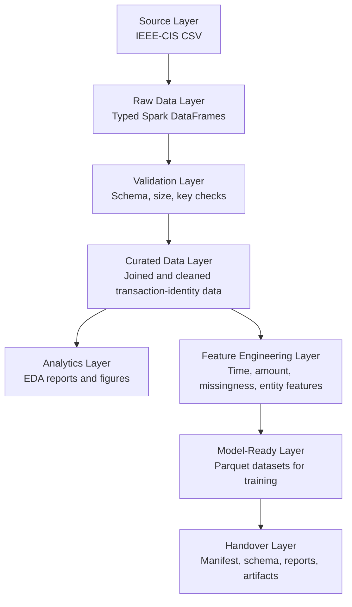
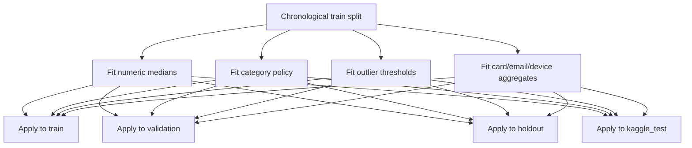
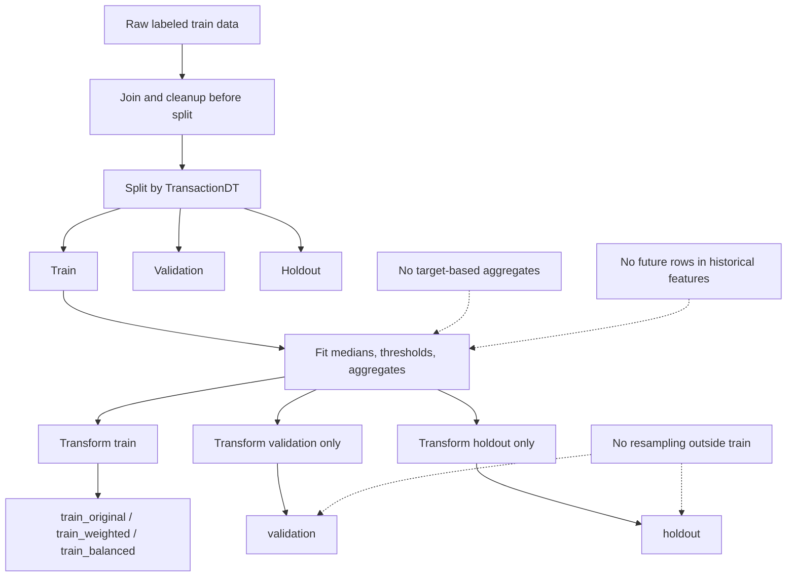
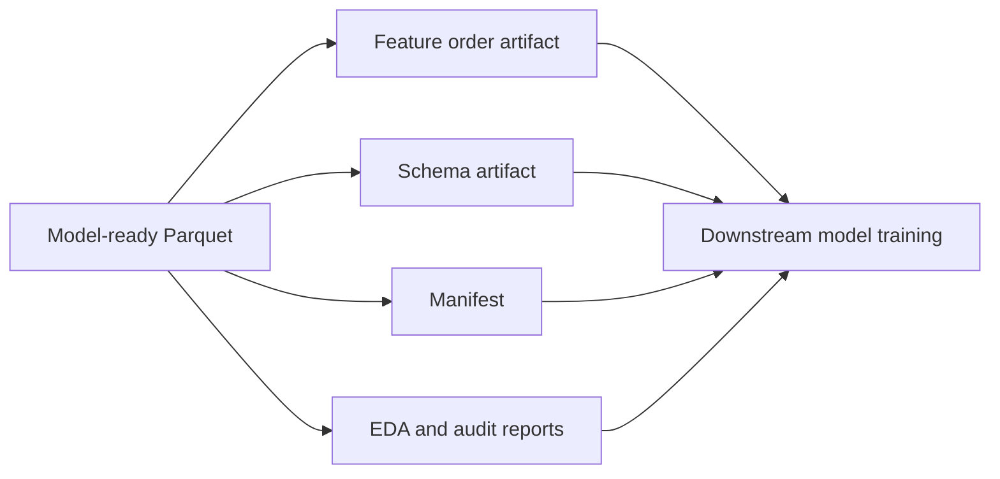

# An Data Pipeline Diagrams — HISTORICAL / SUPERSEDED

> **Authoritative replacement:** [`AN_FINAL_ARCHITECTURE_DIAGRAMS.md`](AN_FINAL_ARCHITECTURE_DIAGRAMS.md).
> The final diagrams correct the as-built/target boundary and leakage wording.

## 1. Layered Data Architecture

## 2. End-to-End Processing Pipeline

```mermaid
flowchart LR
    A[Raw CSV files] --> B[Required-file validation]
    B --> C[Explicit schema Spark ingestion]
    C --> D[Identity-column normalization]
    D --> E[Transaction-identity left join]
    E --> F[Data-quality audit]
    F --> G[Distributed EDA]
    G --> H[Cleaning and base features]
    H --> I[Chronological split]
    I --> J[Train-only fitting]
    J --> K[Feature engineering and aggregates]
    K --> L[Imbalance variants]
    L --> M[Model-ready Parquet export]
```

## 3. Train-Only Transformation Flow

## 4. Data Leakage Prevention Flow

## 5. Model-Ready Handover Flow

