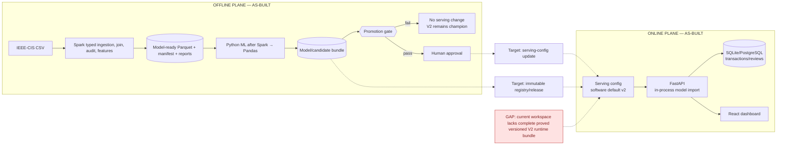
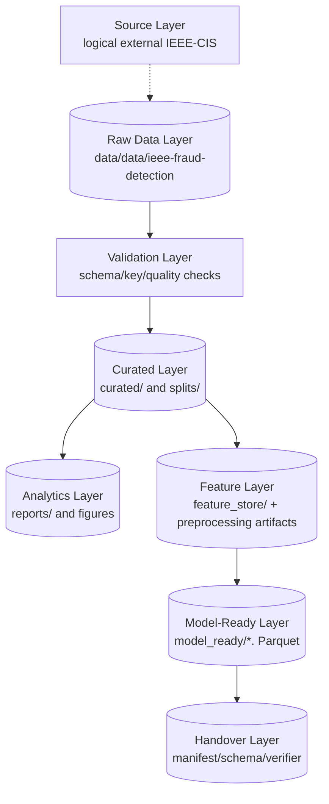
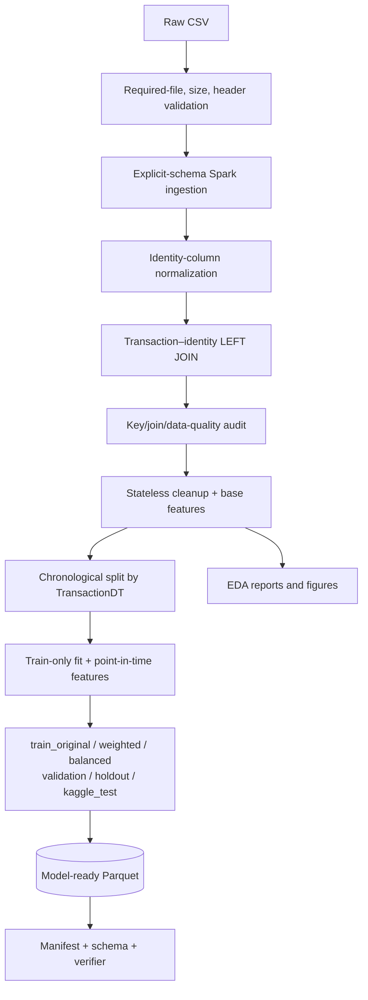
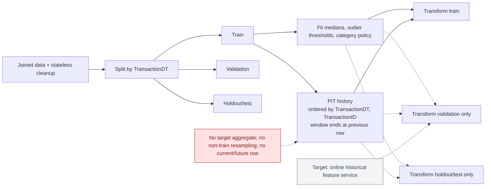
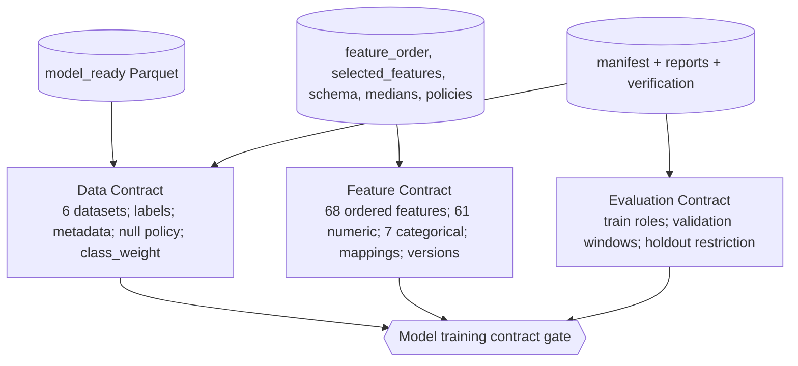
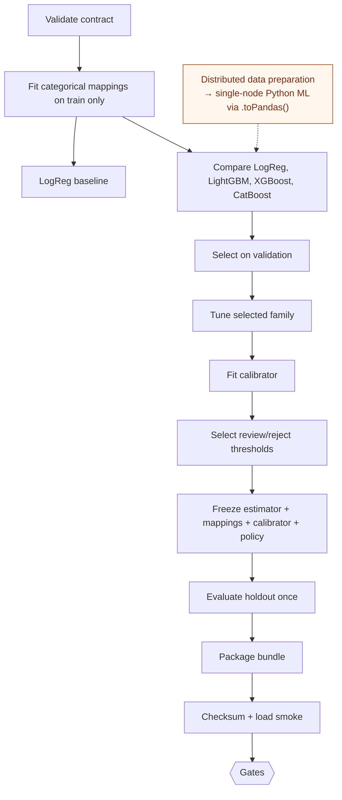
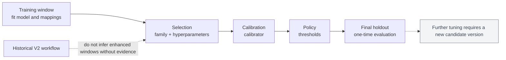

# Bộ sơ đồ kiến trúc cuối — AS-BUILT và TARGET

**Status:** HYBRID WITH EXPLICIT LEGEND. Mermaid trong file này là source of truth.

Legend: solid = implemented/evidenced; dashed = target/partially enforced; gray = legacy; gold = governance gate; red = known gap.

## Diagram 1 — Overall System Architecture

**Status:** HYBRID. **Evidence:** `docker-compose.yml`, pipeline entrypoint, model stages, `score.py`, backend scoring và promotion gate.



Candidate fail never transitions into V2; it leaves serving configuration unchanged.

## Diagram 2 — Layered Data Architecture

**Status:** AS-BUILT, with logical/physical distinction.



## Diagram 3 — Detailed Data Processing Pipeline

**Status:** AS-BUILT. **Evidence:** `data/ieee_cis/pipeline/ieee_cis_preprocess.py`, `pipeline_config.yaml`.



EDA is a reporting branch, not a transformation that must change model-ready data.

## Diagram 4 — Leakage-Controlled Transformation Flow

**Status:** AS-BUILT for batch; online history service is TARGET.



## Diagram 5 — Data, Feature and Evaluation Contracts

**Status:** AS-BUILT.



## Diagram 6 — Model Training Lifecycle

**Status:** HYBRID. Stages implemented; serving policy/registry authority is partly target.



## Diagram 7 — Temporal Development Windows

**Status:** TARGET/AS-BUILT HYBRID. `split_validation_windows()` proves the candidate workflow; do not retrofit it to historical artifacts without metadata.



## Diagram 8 — Promotion State Machine

**Status:** TARGET/AS-BUILT HYBRID. Human approval and registry update are not automated runtime services.

```mermaid
stateDiagram-v2
  [*] --> CREATED
  CREATED --> DATA_VALIDATED --> TRAINED --> CALIBRATED --> POLICY_DEFINED --> HOLDOUT_EVALUATED --> PACKAGED
  PACKAGED --> GATE_PASSED --> AWAITING_APPROVAL --> PROMOTED
  CREATED --> DATA_INVALID
  TRAINED --> TRAINING_FAILED
  PACKAGED --> GATE_FAILED --> ARCHIVED
  AWAITING_APPROVAL --> REJECTED --> ARCHIVED
  GATE_FAILED -->|"serving unchanged"| V2["V2 remains champion"]
  PROMOTED --> ROLLBACK_REQUESTED --> PREVIOUS_CHAMPION_RESTORED
```

## Appendix catalogue

Full-feature versus partial-demo scoring, Spark deployment, single-node training deployment, version lineage, rollback, trust boundaries, training sequence và policy ownership nên đặt ở appendix. Chúng không được dùng để làm as-built claim nếu chỉ là target.
