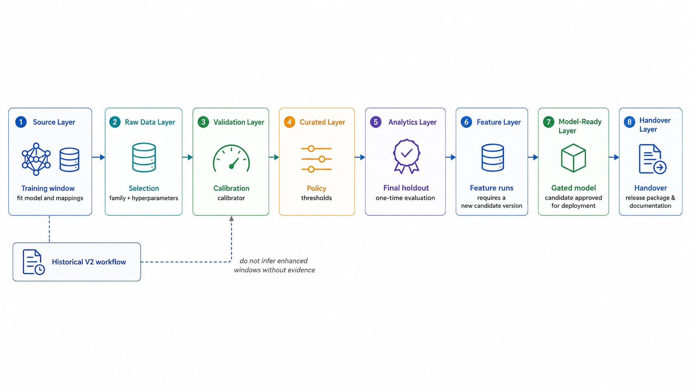
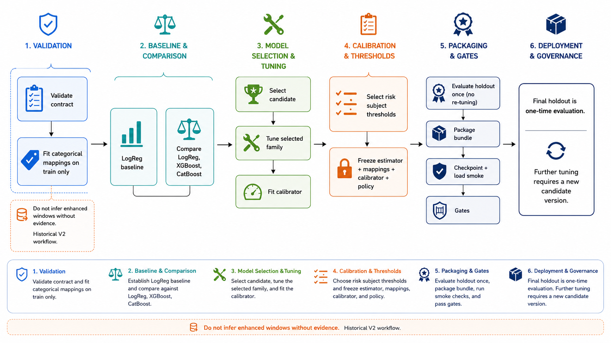
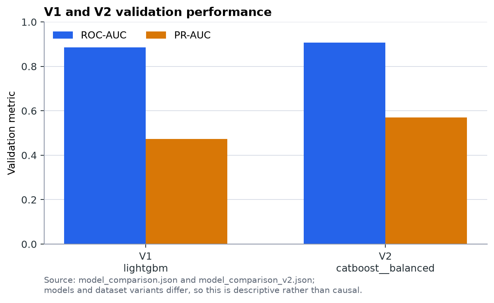

# Apache Spark Data and Model Architecture for IEEE-CIS Fraud Detection

**Trạng thái tài liệu:** AS-BUILT REVIEW WITH EXPLICIT TARGET SECTIONS  
**Snapshot chính:** official artifacts sinh ngày 31/07/2026  
**Đối tượng:** BDA501, thesis và technical review

## Quy ước evidence

Report dùng bốn nhãn. **Implemented** nghĩa là có trong source code. **Artifact-reported** nghĩa là có trong manifest, CSV/JSON metric hoặc artifact đã lưu. **Runtime-verified** nghĩa là đã có test hoặc execution evidence. **Proposed** nghĩa là target architecture hoặc recommendation, chưa được runtime enforce. Những nhãn này không thay thế cho review độc lập; chúng chỉ ngăn việc biến thiết kế đề xuất thành claim về hệ thống hiện tại.

## 1. Executive Summary

Repository hiện thực một hệ thống fraud-risk scoring với data plane chạy bằng Apache Spark và model-development plane chạy bằng Python ML sau khi dữ liệu được handover ở dạng Parquet. Pipeline đọc bốn file IEEE-CIS, thực hiện typed ingestion, chuẩn hóa schema, left join transaction–identity, quality audit, chronological split, train-only preprocessing, point-in-time entity aggregates và xuất sáu dataset model-ready. Kiến trúc mạnh nhất nằm ở data contract, giữ nguyên transaction grain sau left join và kiểm soát leakage bằng thứ tự `TransactionDT`.

Official snapshot xác nhận processing version `ieee-cis-preprocess-2.1.0`, feature schema `ieee-cis-features-1.1.0`, canonical vector gồm 68 features, trong đó 61 numeric và 7 categorical; `TransactionDT` được đưa vào model vector. Verification report hiện tại có 94 checks passed và 0 failed. Tuy nhiên, một bản `reports/official-run/split_summary.csv` vẫn chứa 88,486 validation rows và 89,098 holdout rows, trong khi manifest và persisted chronological report chứa 88,490 và 89,094. Vì vậy report dùng manifest/persisted current split làm số chính và ghi rõ mâu thuẫn snapshot này thay vì hòa trộn chúng.

V2 official training workflow chọn `catboost__balanced` theo selection-window PR-AUC. Validation artifact ghi PR-AUC `0.5805986932` và ROC-AUC `0.9081217221`; holdout artifact ghi PR-AUC `0.4266472301`, ROC-AUC `0.8780747768`, Brier score sau calibration `0.0248335480` so với raw `0.0495279511`. Candidate package có checksum, isotonic calibrator, threshold configuration và artifact-load smoke test. Promotion gate kết luận `not_promoted` vì holdout PR-AUC không đạt reference `0.4582` và Git state dirty; serving version không thay đổi.

Do đó, kết luận đúng là: **software configuration vẫn mặc định v2, nhưng official candidate v2 chưa được promote và chưa có bằng chứng runtime application hoàn tất từ cùng snapshot**. Backend là “In-process model serving inside a modular monolith”; backend có thể áp dụng calibrator nếu artifact được load, nhưng risk bands và approve/review/reject decision vẫn do fixed backend policy quyết định. Partial-demo scoring chỉ là degraded demo path, không phải full-feature online scoring.

Các gap chính là offline–online feature parity, duplicated policy ownership, single-node Pandas boundary, local MLflow, fallback fail-open, coupling giữa backend và model artifact, và việc trộn as-built với target architecture trong tài liệu cũ. Report này phù hợp cho BDA501 ở mức kiến trúc và phương pháp, nhưng không tuyên bố production readiness.

## 2. Project Scope and Dataset

Mục tiêu của project là xây dựng một pipeline Big Data có khả năng biến IEEE-CIS transaction và identity CSV thành dữ liệu training-ready, sau đó cung cấp fraud probability và risk decision cho ứng dụng FastAPI/React. Scope review tập trung vào data architecture, model lifecycle, governance evidence và serving boundary; không đánh giá chất lượng kinh doanh của quyết định fraud ngoài những metric đã được lưu.

### 2.1 Dataset evidence

| Dataset | Rows | Columns | Size | Label | Role |
|---|---:|---:|---:|---|---|
| `train_transaction.csv` | 590,540 | 394 | 651.69 MB | `isFraud` | labeled transaction source |
| `train_identity.csv` | 144,233 | 41 | 25.30 MB | none | optional identity enrichment |
| `test_transaction.csv` | 506,691 | 393 | 584.79 MB | none | unlabeled scoring source |
| `test_identity.csv` | 141,907 | 41 | 24.60 MB | none | optional test enrichment |

Nguồn: `dataset_inventory.csv` và `manifest.json`. Join key là `TransactionID`. `TransactionDT` không phải timestamp lịch; code dùng nó làm relative ordering để tạo day/week/hour và chronological boundaries. Raw labeled train có 20,663 fraud rows trên 590,540 transactions, tương đương fraud rate artifact `3.499001%`. Đây là positive-class imbalance đáng kể, nên PR-AUC được ưu tiên hơn accuracy.

Project contribution được evidence trong repository ở các deliverable: Spark preprocessing, quality/EDA reports, feature contract, train-only artifacts, model-ready Parquet, V2 training stages, candidate packaging, promotion gate và architecture documentation. Bất kỳ claim cá nhân vượt quá các deliverable này cần được xác nhận thêm từ log hoặc thesis source.

## 3. Key Data Challenges

Dataset transaction vượt 500 MB và khi nối với identity có high dimensionality, missingness lớn, categorical cardinality và transaction/identity grain khác nhau. Đọc toàn bộ raw CSV bằng Pandas sẽ làm mất mục tiêu distributed preparation; source code vì vậy dùng Spark DataFrame và chỉ chuyển dữ liệu đã giảm phạm vi sang Pandas ở một số báo cáo hoặc training boundary. Đây là quyết định phù hợp cho BDA501, nhưng không loại bỏ giới hạn driver memory ở model training.

Fraud label bị lệch mạnh: class distribution artifact có 569,877 legitimate và 20,663 fraud. `TransactionDT` tạo thêm rủi ro temporal leakage: nếu aggregate hoặc imputation được fit trên cả dataset, validation/holdout có thể vô tình nhìn thấy tương lai. Entity history cũng nhạy cảm vì card, email và device có thể lặp lại trong dòng thời gian. Pipeline giải quyết bằng chronological split, train-only thresholds/mappings và history window kết thúc trước current row.

Anonymized `C*`/`D*` columns làm cho feature semantics hạn chế; EDA chỉ nên được đọc như association mô tả, không phải causal explanation. Identity coverage train là `24.423917%`, test là `28.006615%`; do đó `has_identity` không chỉ là join kỹ thuật mà còn là một feature presence được đưa vào model vector. Hệ thống cũng phải xử lý category missing/unseen và giữ metadata như `split_name`, `processing_version`, `feature_schema_version`, `generated_at` ngoài feature vector.

## 4. Overall System Architecture


*Figure 1. Overall system architecture, HYBRID. Solid paths represent implemented/evidenced data and serving boundaries; dashed paths are target governance components. Source: `pipeline/fraud_risk_data_pipeline.py`, `model/src/fraud_model/config.py`, `model/src/fraud_model/score.py`, `backend/src/fraud_backend/scoring.py`, `model/src/fraud_model/promotion_gate.py`.*

Hình cho thấy hai plane. Offline plane gồm Spark preprocessing, model-ready Parquet, Python model training, candidate bundle và promotion gate. Online plane gồm serving config, FastAPI in-process model import, database/review workflow và React dashboard. Đây là as-built boundary ở mức source code; human approval, immutable registry/release và serving-config update là target hoặc partially enforced, không phải automatic runtime service.

Quy tắc governance quan trọng là candidate fail không chuyển thành V2. Promotion artifact ghi `serving_version_unchanged: true`; vì vậy gate failure giữ nguyên serving configuration. Comment trong `model/src/fraud_model/config.py` gọi V2 là production default, nhưng artifact `promotion_decision_v2.json` ghi `not_promoted`; report ưu tiên decision artifact và diễn giải v2 là software default/configured serving version, không phải production approval.

## 5. Layered Data Architecture



*Figure 2. Layered data architecture, HYBRID. Các layer chỉ được gọi physical khi có persisted path trong repository; target online feature service không được xem là physical as-built layer.*

| Layer | Logical/Physical | Input | Processing | Persisted output | Consumer |
|---|---|---|---|---|---|
| Source | Physical | IEEE-CIS CSV | external source discovery | raw files under data mount | Spark ingestion |
| Raw | Physical | source CSV | read-only validation and inventory | raw input path, checksums in manifest | pipeline |
| Validation | Physical | raw files | schema, key, size and quality checks | `reports/`, `verification_report.json` | pipeline/model team |
| Curated | Physical | joined Spark DataFrame | normalization, cleanup, left join | `curated/`, split outputs | EDA/features |
| Analytics | Physical | curated data | grouped EDA and profiles | CSV/Parquet reports, figures | report/reviewer |
| Temporal split | Physical | labeled curated data | q70/q85 `TransactionDT` boundaries | `split_thresholds.json`, split reports | preprocessing/model |
| Feature | Physical | split data and entity keys | time, amount, presence and history features | `feature_store/`, preprocessing artifacts | model-ready export |
| Model-ready | Physical | engineered splits | contract columns and imbalance variants | six Parquet datasets | Python ML |
| Handover | Logical + physical | model-ready and artifacts | manifest/schema/readiness contract | `manifest.json`, schema and handover docs | training/serving |

Source, raw và target online feature service không nên bị mô tả cùng một cách. Raw và model-ready có paths thực tế; online feature service chỉ là target. `feature_store/` hiện là persisted batch lookup/output, không phải online low-latency feature store.

## 6. Spark Data Processing Pipeline


*Figure 3. Detailed data processing pipeline, AS-BUILT. EDA là reporting branch; nó không phải transformation bắt buộc làm thay đổi model-ready rows. Source: `data/ieee_cis/pipeline/ieee_cis_preprocess.py` và generated reports.*

Pipeline maintained entrypoint là `pipeline/fraud_risk_data_pipeline.py`, gọi shared Spark implementation. Sequence chính là required-file validation, explicit-schema ingestion, identity-column normalization, transaction–identity left join, key/join audit, stateless cleanup, EDA reports, chronological split, training-only fitting, point-in-time features, weighted/balanced variants, Parquet export, manifest và verification.

Spark DataFrame giữ transaction grain qua left join. Join audit ghi train `590,540` transaction rows, `144,233` matched identity rows, `446,307` unmatched rows và `590,540` joined rows; test tương ứng `506,691`, `141,907`, `364,784` và `506,691`. Row difference bằng zero cho cả hai. Đây là evidence mạnh rằng identity enrichment không làm nhân bản transaction rows trong persisted run.

### 6.1 Source validation and typed ingestion

**Implemented:** pipeline kiểm tra required files, header/schema và kích thước, sau đó đọc bằng explicit Spark schema. Raw schema artifacts được ghi cho train/test transaction và identity; manifest lưu row count, column count, size và SHA-256. Thiết kế tránh full-data Pandas vì CSV transaction lớn hơn 500 MB và join/aggregation phù hợp với Spark SQL.

**Runtime-verified:** official model-quality log ghi model lint passed và `14 passed` tests. Official verification report ghi `94` checks passed, `0` failed. **Limitation:** application build trong official log dừng ở frontend `npm ci` do lockfile cũ; lockfile đã được đồng bộ sau đó và frontend build độc lập đã thành công, nhưng điều này không biến official full run cũ thành một runtime snapshot hoàn chỉnh.

## 7. Data Quality and EDA Findings

EDA reports được tạo từ Spark aggregations và export sang CSV/PNG. Chúng mô tả distribution và association, không chứng minh nguyên nhân fraud.


*Figure 4. Class distribution, AS-BUILT. Nguồn: `reports/class_distribution.csv`; fraud chiếm `20,663/590,540` transactions trong raw labeled train.*


*Figure 5. Fraud rate by ProductCD, AS-BUILT. Nguồn: `reports/fraud_by_product_csv`; đây là group-level association, không phải causal effect.*

Các insight được giữ ở mức có ích cho architecture:

1. **Imbalance là constraint chính.** Raw class report có `96.500999%` legitimate và `3.499001%` fraud; training workflow vì vậy cung cấp `train_original`, `train_weighted` và `train_balanced` thay vì resampling validation/holdout.
2. **ProductCD có rate khác nhau.** Artifact ghi ProductCD `c` là `11.687269%`, `s` `5.899553%`, `h` `4.766231%`, `r` `3.782594%`, `w` `2.039939%`. Feature engineering giữ ProductCD dưới dạng categorical, không gán causal meaning.
3. **Identity presence là signal cần preserve.** Transactions có identity match có fraud rate `7.847025%`, trong khi unmatched là `2.093850%`. Pipeline tạo `has_identity` và identity missingness features; model không được hiểu đây là bằng chứng identity gây fraud.
4. **Card6 khác biệt mạnh.** `credit` có fraud rate `6.678480%`, `debit` `2.426251%`, và missing `2.482495%`. Category policy xử lý missing/unseen thay vì drop rows.
5. **Transaction hour có profile không phẳng.** Report peak là hour 7 với `10.610151%`; hour 13 là `2.288949%`. `transaction_hour` được dẫn xuất từ relative `TransactionDT`, nên đây là pattern trong dataset order, không phải giờ địa phương.
6. **Amount band không monotonic.** Bands `00_0_10` và `01_10_25` có rates `7.765998%` và `5.911628%`; band `07_1000_plus` là `2.463190%`. Pipeline giữ original amount, log/capped amount và flags; outlier không bị drop tự động.

Các bảng chi tiết ProductCD, card6, identity, hour và amount band nằm trong generated reports; report chính chỉ giữ các figure hỗ trợ trực tiếp cho kết luận kiến trúc.

## 8. Leakage Prevention and Temporal Split


*Figure 6. Leakage-controlled transformation flow, AS-BUILT. Learned statistics được fit trên chronological training scope và apply unchanged; history frame kết thúc trước current row. Source: `ieee_cis_preprocess.py`, `temporal_features.py`, preprocessing artifacts.*

Split ratios được cấu hình 70/15/15 theo `TransactionDT`. Current persisted manifest và `chronological_split_csv` ghi:

| Split | Rows | Fraud | Fraud rate | Min TransactionDT | Max TransactionDT |
|---|---:|---:|---:|---:|---:|
| train | 412,956 | 14,522 | 3.516597% | 86,400 | 10,432,902 |
| validation | 88,490 | 3,036 | 3.430896% | 10,432,915 | 13,136,653 |
| holdout | 89,094 | 3,105 | 3.485083% | 13,136,664 | 15,811,131 |

**Implemented:** stateless normalization có thể diễn ra trước split; median, outlier thresholds và category policy được fit train-only. `outlier_thresholds.json` ghi `fit_scope: chronological_training_only`, P25 `42.95`, P75 `125.0`, IQR `82.05`, upper cap `248.075`, P95 `434.95`, P99 `1044.95` và distance threshold `1000`. Validation/holdout nhận frozen artifacts.

Historical features dùng Window order `(TransactionDT, TransactionID)` và frame kết thúc ở `-1`, nên current row không tự xuất hiện trong history. Training timeline dùng previous rows; test history stream có thể dùng labeled và earlier test events theo point-in-time order, nhưng không nhìn future row. Không có evidence về target-based aggregate. Resampling chỉ áp dụng cho train-balanced; validation/holdout giữ phân bố tự nhiên.

Mâu thuẫn evidence: một copied `reports/official-run/split_summary.csv` ghi validation `88,486` và holdout `89,098`; persisted manifest và current Spark report ghi `88,490` và `89,094`. Report chọn manifest/current persisted split vì đó là output trực tiếp của pipeline hiện tại; inconsistency được mở trong consistency report.

## 9. Feature Engineering and Imbalance Handling

Canonical feature order có 68 entries: 61 numeric và 7 categorical (`ProductCD`, `card4`, `card6`, `DeviceType`, `device_family`, `M4`, `amount_band`). Nhóm feature gồm time, amount, missingness/presence, distance, selected C/D columns và prior card/email/device histories. `TransactionDT` nằm trong vector; các metadata `TransactionID`, `isFraud`, `split_name`, version fields và `generated_at` không nằm trong canonical model vector.

Feature transformations gồm `log_transaction_amount`, capped amount, decimal component, day/week/hour, night flag, missing counts/ratios, identity/device/email presence, same email domain, high/outlier flags, ratios/deviations và categorical normalization. Numeric imputation dùng median artifact; categorical missing là `__MISSING__`, unseen là `__UNKNOWN__`, rare category là `__OTHER__`. Mapping và median không được refit trên validation, holdout hoặc Kaggle test.

Historical aggregate features như `prior_card_transaction_count`, `prior_card_amount_sum`, `prior_card_avg_amount`, `time_since_previous_card_transaction`, email/device count và amount aggregates là batch features có context. Đây là lý do batch full-feature scoring có thể tạo vector 68 features, còn API request chỉ chứa vài fields không thể tự tái tạo chúng. Imbalance artifact ghi fraud weight `14.2182894918`, legitimate weight `0.5182238464`, undersampling ratio legitimate-to-fraud `3.0`, seed `42`.

## 10. Data, Feature and Evaluation Contracts


*Figure 7. Data, feature and evaluation contracts, AS-BUILT. Manifest/verifier cung cấp evidence và readiness; source code/training policy mới là nơi định nghĩa hành vi.*

| Contract | Nội dung | Evidence | Limitation |
|---|---|---|---|
| Data contract | six datasets, label presence, metadata columns, schema hashes, class weight only for weighted train | manifest, model-ready schema, verifier | copied snapshots có split-count discrepancy |
| Feature contract | 68 ordered features, 61 numeric, 7 categorical, mappings, versions | `feature_order.json`, `category_policy.json` | online feature construction chưa có |
| Evaluation contract | train variant, selection/calibration/policy windows, holdout restriction, no non-train resampling | `data.py`, `validate_data.py`, training metadata | historical V1 workflow không giống enhanced V2 workflow |
| Serving contract | probability, risk score, band, decision, scoring mode, model/version metadata | API contract, backend service, score module | policy runtime không load threshold config |

Model-ready outputs:

| Dataset | Rows | Label | Special columns | Intended use |
|---|---:|---|---|---|
| `train_original` | 412,956 | yes | no `class_weight` | natural training distribution |
| `train_weighted` | 412,956 | yes | `class_weight` | weighted model training |
| `train_balanced` | 58,394 | yes | legitimate undersampled | balanced candidate training |
| `validation` | 88,490 | yes | untouched | selection/calibration/policy windows |
| `holdout` | 89,094 | yes | untouched | final evaluation |
| `kaggle_test` | 506,691 | no | no label | unlabeled scoring |

Parquet là handover boundary vì giữ schema, hỗ trợ column pruning và đọc lại trong Spark/Python. Manifest và verifier là evidence của contract, không phải tự động chứng minh mọi evaluation policy đã được enforce trong mọi historical run.

## 11. Model Training Methodology



*Figure 8. Model training lifecycle, HYBRID. Solid stages có source/artifact; approval/registry automation là target. Source: `validate_data.py`, `train_compare.py`, `tune_and_explain.py`, `package_candidate.py`, `promotion_gate.py`.*

Training boundary phải được mô tả chính xác là **“Distributed data preparation with single-node Python model training.”** Spark writes Parquet; Python loader converts model matrices to Pandas; Logistic Regression, LightGBM, XGBoost và CatBoost train in the Python process. Official manifest dùng Spark `local[4]` cho preprocessing; candidate manifest ghi `local[*]`. Không có evidence để gọi gradient boosting distributed trên Spark workers.

Lifecycle hiện có: validate data contract, load canonical feature order, fit category mappings trên train, train baseline Logistic Regression, compare model families/dataset variants, select by PR-AUC, tune selected family, fit isotonic calibrator, choose review/reject thresholds, freeze artifact, evaluate holdout, package checksum/smoke evidence và apply gates. Candidate identity gồm version, model name, feature count, processing/schema versions, calibrator, threshold config và MLflow holdout run ID.

Official V2 comparison artifact cho thấy các candidates Logistic Regression, LightGBM, XGBoost, CatBoost và balanced variants. Best selection là `catboost__balanced`; training metadata ghi model `catboost`, dataset `balanced`, feature count 68, selection window 44,245 rows, calibration 22,123 và policy 22,122. Đây là V2 official workflow hiện tại; các tài liệu cũ mô tả V2 LightGBM cần được xem là historical hoặc superseded.

## 12. Model Results and Champion–Challenger Decision

### 12.1 Official V2 metrics

| Dataset/stage | Threshold | PR-AUC | ROC-AUC | Precision | Recall | Brier |
|---|---:|---:|---:|---:|---:|---:|
| validation selection | 0.50 | 0.5805986932 | 0.9081217221 | 0.3969648562 | 0.6220275344 | — |
| holdout | 0.16 | 0.4266472301 | 0.8780747768 | 0.3820037987 | 0.5181964573 | 0.0248335480 |

Holdout confusion counts là TN `83,386`, FP `2,603`, FN `1,496`, TP `1,609`; raw Brier `0.0495279511`. Validation selection và holdout có threshold context khác nhau; PR-AUC/ROC-AUC là ranking metrics, còn precision/recall/confusion counts phụ thuộc threshold.

### 12.2 Calibration and policy

V2 artifact lưu `calibration_model_v2.joblib` và training metadata ghi calibration method `isotonic`. Calibration Brier thấp hơn raw ở holdout; vì vậy calibration evidence tồn tại trong candidate package. Tuy nhiên, serving activation phải được phân biệt: `score.py` có code áp dụng `artifact["calibrator"]` nếu artifact chứa field này, còn backend risk policy không đọc `threshold_config` để quyết định band.

| Policy element | Defined in | Loaded by | Runtime authority |
|---|---|---|---|
| review threshold `0.16` | `threshold_config_v2.json` | candidate scoring/package path | model artifact policy, but not backend band decision |
| reject threshold `0.53` | `threshold_config_v2.json` | candidate/package path | not used by `backend/src/fraud_backend/risk.py` |
| risk bands 0–19, 20–39, 40–59, 60–79, 80–100 | `backend/src/fraud_backend/risk.py` | backend | backend fixed policy |
| approve/review/reject | backend band mapping | backend service | backend fixed policy |

Đây là duplicated ownership. Target recommendation là tách Model Bundle (estimator, mappings, calibrator, metadata) khỏi Policy Bundle (thresholds, bands, policy version), rồi backend trả `model_version`, `calibration_version`, `policy_version`. Target này chưa được enforce đầy đủ.

### 12.3 V1 and V2 comparison

Current artifacts có V1 validation comparison và V2 validation comparison, nhưng không có V1 final holdout CSV tương đương trong `model/artifacts`. Vì vậy không dùng các holdout values từ historical Markdown làm official current metric.

| Metric | V1 artifact best validation LightGBM | V2 official selected validation CatBoost balanced | Status |
|---|---:|---:|---|
| ROC-AUC | 0.8863310911 | 0.9081217221 | artifact-reported, not apples-to-apples |
| PR-AUC | 0.4739303551 | 0.5703385033 in comparison; final tuned metadata 0.5805986932 | artifact-reported |
| Holdout ROC-AUC | unavailable in matching V1 artifact | 0.8780747768 | V1 unavailable; V2 available |
| Holdout PR-AUC | unavailable in matching V1 artifact | 0.4266472301 | V1 unavailable; V2 available |



*Figure 9. V1/V2 validation performance, artifact-reported. Models và dataset variants khác nhau; chart mô tả evidence, không chứng minh feature group hoặc model family gây ra cải thiện.*

Old reports mention V1 53 features and V2 68 features, and historical V2 LightGBM metrics such as holdout PR-AUC `0.4582`. Current official V2 package instead identifies CatBoost balanced and holdout PR-AUC `0.4266472301`. This is not a minor rounding issue; it is a workflow/version mismatch and must be labeled accordingly.

Promotion decision is explicit: `status: not_promoted`, failed gates `holdout_pr_auc` and `git_clean`, while ROC-AUC, precision, calibration non-regression, checksum, artifact smoke, data contract and version match passed. Therefore the candidate did not replace serving configuration. This is a correct governance outcome, not deployment failure.

## 13. Serving Architecture and Integration Limits

Serving is **In-process model serving inside a modular monolith.** FastAPI imports the model package directly; no independent model-service network boundary is present. Backend stores scored transactions and review state in SQLite/PostgreSQL, while React displays score/risk band/decision. This reduces serialization and deployment complexity for the demo, but couples API startup, model dependencies, artifact loading and model scaling.

The model scorer distinguishes `full_feature` from `partial_demo`. In full-feature mode, caller supplies the canonical vector and score module maps categories, fills missing values and optionally applies calibrator. In partial-demo mode, missing columns are defaulted to `-999`; this allows UI continuity but cannot recreate historical card/email/device aggregates. The scorer includes `scoring_mode` in its response; this is the correct architecture boundary and must remain visible in UI/reporting.

Fallback behavior is fail-open/degraded demo mode: if model import or artifact load fails, backend uses `_HeuristicScorer`, returns `model_name: unavailable-heuristic`, and can continue serving. This is explicit rather than silent, but `/health` readiness must be reviewed so a model-unavailable process is not mistaken for model-ready serving. Official application build was not fully completed in the stored run because frontend lockfile mismatch; later standalone frontend Docker build succeeded after lockfile synchronization.

## 14. Architecture Gaps and Recommendations

| ID | Area | Current state | Risk | Recommendation | Priority |
|---|---|---|---|---|---|
| G1 | Offline–online feature parity | batch historical aggregates exist; online feature service absent | API score can differ from batch score | add versioned online feature service or restrict API to full vectors | Critical |
| G2 | Policy ownership | backend fixed bands coexist with artifact thresholds | calibrated candidate policy may not control decisions | separate approved Policy Bundle and return policy version | Critical |
| G3 | As-built/target mixing | old docs describe registry/promotion/LightGBM claims as current | thesis may overstate implementation | label historical, as-built and target in every diagram/report | High |
| G4 | Spark-to-Pandas boundary | Python ML uses Pandas/single-node process | driver-memory and scale ceiling | benchmark partitioned/distributed training option | High |
| G5 | MLflow role | local SQLite tracking and artifact lineage | no evidenced central registry or stage transition | keep wording as experiment tracking; add registry only with evidence | High |
| G6 | Serving coupling | backend imports model in-process | model/API scaling and dependency upgrades are coupled | consider standalone model service after feature contract stabilizes | Medium |
| G7 | Fallback | heuristic scorer keeps API available | fail-open score can be mistaken for model score | strict readiness endpoint and explicit degraded-mode response | High |
| G8 | Holdout governance | gate exists, but later tuning after holdout would risk reuse | optimistic selection bias | close candidate after holdout; create new version for changes | High |
| G9 | Artifact trust | joblib checksum exists for V2 candidate; registry immutable storage absent | untrusted deserialization/version drift | store signed/immutable bundle and verify checksum before load | Medium |
| G10 | V1 metadata | legacy root artifact lacks equivalent metadata | rollback compatibility ambiguity | package V1 with explicit model/schema/policy metadata | Medium |

Five prioritized actions trước khi final report hoặc deployment decision:

1. Regenerate/copy one coherent official snapshot so manifest, split summary, verification report, model metrics and report facts share the same rows and checksums.
2. Make runtime policy ownership explicit by loading an approved policy artifact or documenting backend fixed bands as the sole authority.
3. Add readiness checks that distinguish model-ready, fallback heuristic và partial-demo mode.
4. Keep holdout sealed after a candidate decision; issue a new candidate version for any post-holdout change.
5. Preserve current artifact checksum, feature schema, processing version and Git state in an immutable handover location.

## 15. Conclusion

Core architecture phù hợp với BDA501: Spark typed ingestion và left join xử lý đúng bài toán Big Data; Parquet tạo handover boundary rõ; chronological split, train-only statistics và previous-row history cung cấp leakage controls có thể audit; canonical 68-feature contract và verifier làm giảm training-serving skew; model package/gate thể hiện champion–challenger governance.

Phần chưa hoàn chỉnh không nằm ở việc thiếu một sơ đồ đơn lẻ mà ở ranh giới giữa batch evidence và online runtime. Historical features chưa có online feature service; backend policy chưa dùng threshold artifact; MLflow hiện là local tracking/lineage; model training sau Spark vẫn single-node Python; fallback có thể tiếp tục trả điểm khi model không load. V2 là configured serving default trong code, nhưng current official candidate v2 là `not_promoted`; report không gọi nó là production-promoted model.

**Final assessment:** report phản ánh một as-built Spark batch data pipeline và model-development workflow có kiểm soát leakage, handover contract rõ và promotion gate đúng hướng. Các gap cần giữ visible trước khi nộp thesis là offline–online feature parity, runtime policy ownership và separation giữa as-built với target governance. Kết luận này không phải production-readiness claim.

## Appendix A — Detailed Feature Groups

| Group | Representative features |
|---|---|
| Time | `TransactionDT`, `transaction_day`, `transaction_week`, `transaction_hour`, `transaction_age_days`, `is_night_transaction` |
| Amount | `TransactionAmt`, log amount, capped amount, decimal amount, `amount_band`, high/outlier flags, card-mean ratios |
| Missingness/presence | selected/identity missing count and ratio, `has_identity`, device/email/distance/address presence |
| Transaction attributes | `dist1`, `dist2`, selected `C*` and `D*` columns |
| Historical entities | prior card/email/device counts, sums, averages, stddev and time since previous card transaction |
| Categorical | `ProductCD`, `card4`, `card6`, `DeviceType`, `device_family`, `M4`, `amount_band` |

## Appendix B — Additional Diagrams

The final diagram source is [AN_FINAL_ARCHITECTURE_DIAGRAMS.md](AN_FINAL_ARCHITECTURE_DIAGRAMS.md). The rendered exports are in [docs/diagrams/final](diagrams/final/). Training sequence, Spark deployment, full-feature/partial-demo scoring and trust-boundary diagrams should remain appendix material unless a later thesis layout needs them in the main body.

## Appendix C — Reproduction Commands

```bash
# preprocessing and verification
bash scripts/run_official_full.sh

# model checks in the training image
docker compose --profile training run --rm model-training-local uv run ruff check .
docker compose --profile training run --rm model-training-local uv run pytest -q

# frontend dependency/build check
cd frontend
npm ci
npm run build
```

The official run is evidence-producing, not a guarantee that every later local workspace state is identical. Preserve the generated `reports/official-run/` directory and record Git dirty state.

## Appendix D — Evidence and Artifact Paths

- Spark source: `data/ieee_cis/pipeline/ieee_cis_preprocess.py`
- Pipeline contract: `pipeline/processed_contract.py`, `pipeline/verify_processed_data.py`
- Current manifest: `data/processed/ieee_cis_fraud_risk/manifest.json`
- Model-ready schema: `data/processed/ieee_cis_fraud_risk/artifacts/schema/model_ready_schema.json`
- Feature order: `data/processed/ieee_cis_fraud_risk/artifacts/preprocessing/feature_order.json`
- Official V2 artifacts: `reports/official-run/` and `model/artifacts/v2/`
- Promotion decision: `model/artifacts/v2/promotion_decision_v2.json`
- Serving scorer: `model/src/fraud_model/score.py`, `backend/src/fraud_backend/scoring.py`
- Runtime risk policy: `backend/src/fraud_backend/risk.py`
- MLflow tracking: `model/src/fraud_model/tracking.py`, `model/artifacts/mlflow.db`
- Official execution logs: `reports/official-run/*.log`

## Appendix E — BDA501 Mapping and Repository Contribution

| BDA501 requirement | Implementation observed | Evidence |
|---|---|---|
| Dataset above 500 MB | train/test transaction CSVs exceed 500 MB | `dataset_inventory.csv`, manifest |
| Apache Spark ingestion | typed Spark DataFrames and explicit schemas | `ieee_cis_preprocess.py` |
| Cleaning and normalization | column normalization, categorical cleanup, null policy | preprocessing source and artifacts |
| Descriptive analysis | class, product, identity, hour, amount and quality reports | `reports/` CSV/PNG outputs |
| Filtering and aggregation | Spark groupBy, quantile and entity history operations | preprocessing source |
| Window operations | chronological entity histories ordered by `TransactionDT` and `TransactionID` | `temporal_features.py`, preprocessing source |
| Model-ready handover | Parquet datasets, schema hashes, feature order and manifest | `model_ready/`, `artifacts/`, `manifest.json` |
| ML baseline | Logistic Regression baseline stage | `train_baseline.py`, baseline artifact |
| Model comparison | LightGBM, XGBoost, CatBoost and balanced variants | `train_compare.py`, comparison JSON |
| Reproducibility | versions, seeds, checksums, MLflow local lineage and logs | official artifacts and `tracking.py` |

Repository evidence supports describing the contribution as data architecture,
Spark processing, EDA/report generation, leakage-controlled feature preparation,
contract handover, model lifecycle packaging and architecture documentation.
This table does not assign unverified individual work beyond those deliverables.

## Appendix F — Evidence Classification Matrix

| Claim | Classification | Why it is classified this way |
|---|---|---|
| Spark typed ingestion and Parquet export exist | Implemented | Source code contains Spark readers, transformations and writes; persisted output paths exist |
| Current persisted data passed 94 verification checks | Runtime-verified / Artifact-reported | `verification_report.json` records 94 passed and 0 failed in the current run |
| The vector contains 68 features and includes `TransactionDT` | Artifact-reported | Feature-order and schema artifacts enumerate the vector and metadata exclusion |
| Historical features exclude current/future rows | Implemented | Window frame and ordering logic end before the current row; this is a code-level control |
| V2 official candidate is CatBoost balanced | Artifact-reported | Candidate manifest and training metadata identify the model and dataset variant |
| V2 is promoted | Not supported | Promotion decision is `not_promoted`; serving version remains unchanged |
| V2 is the configured software default | Implemented/configuration evidence | `SERVING_MODEL_VERSION` defaults to `v2`; this is not approval evidence |
| Isotonic calibration is present in the candidate bundle | Artifact-reported | Calibrator joblib, metadata and Brier metrics are persisted |
| Calibrated probability controls backend decisions | Not supported | Backend `risk.py` maps fixed risk bands and does not load candidate threshold config |
| MLflow is a central model registry | Not supported | Code configures local SQLite tracking and artifact logging; registry transition is not evidenced |
| Online full-feature scoring is available | Not supported | Request-time historical feature service is absent; partial mode defaults missing values |
| Online feature store is the target | Proposed | It is a recommendation for closing offline–online parity, not a current persisted service |

This classification matters because the repository contains more design intent
than currently enforced runtime behavior. For example, candidate packaging
already records checksum, calibration and policy metadata, which is a strong
governance foundation. It does not follow that the backend has adopted every
field as a decision authority. Similarly, the presence of a local MLflow
database proves experiment lineage was recorded, not that a registry supplied
the serving model. The report therefore treats architecture boundaries as
independent claims and ties each one to the smallest evidence set that supports
it.
