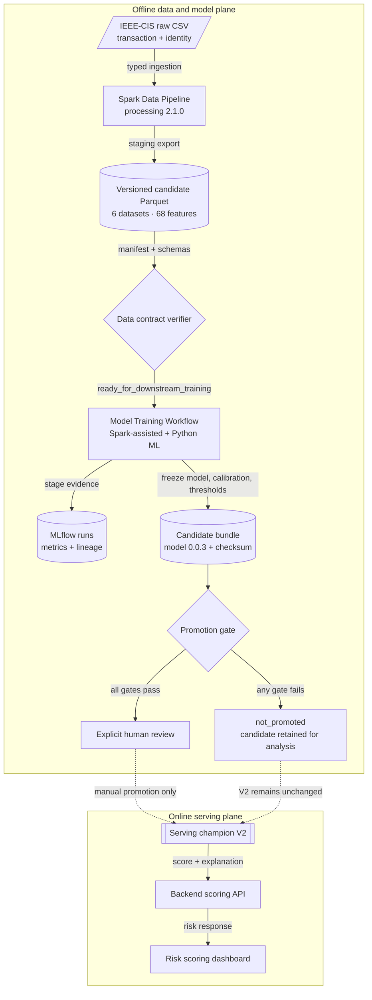
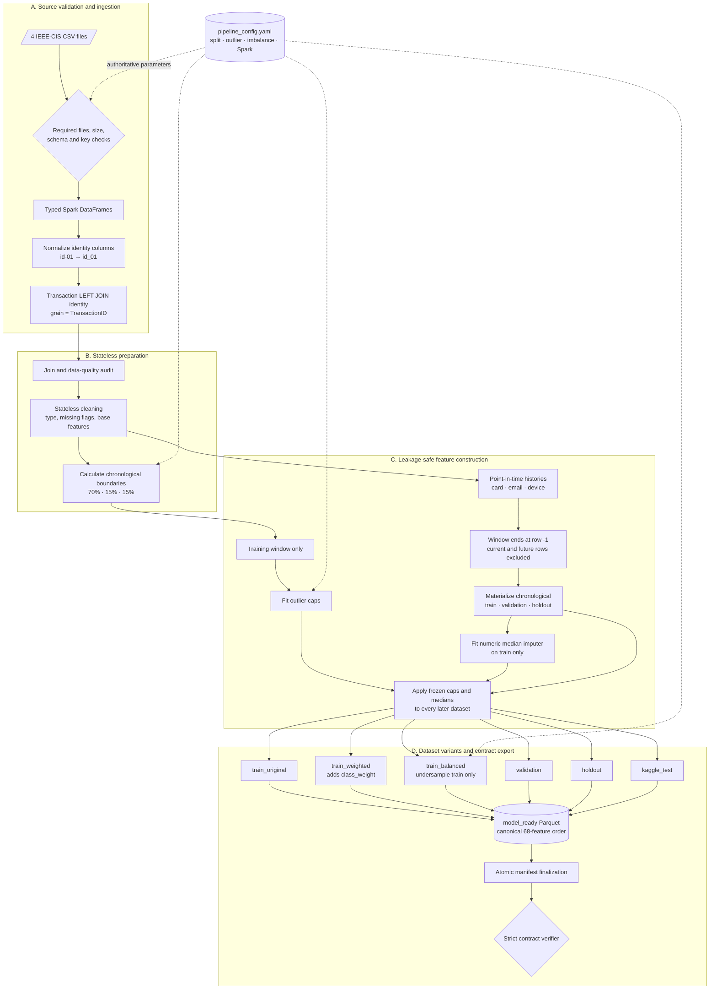
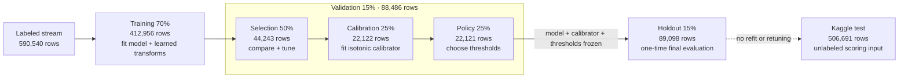
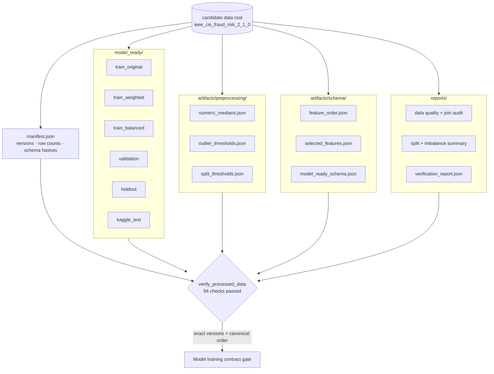
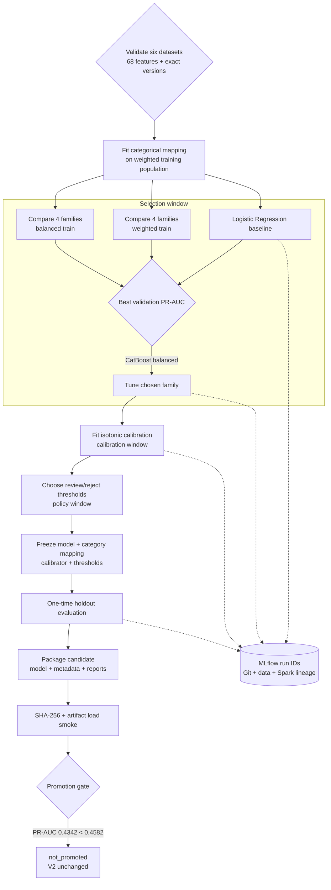
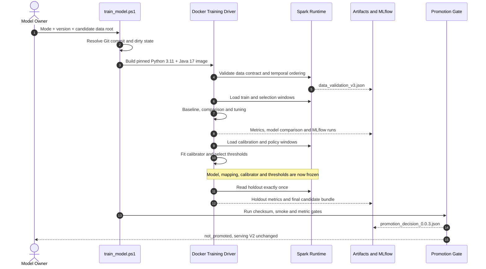
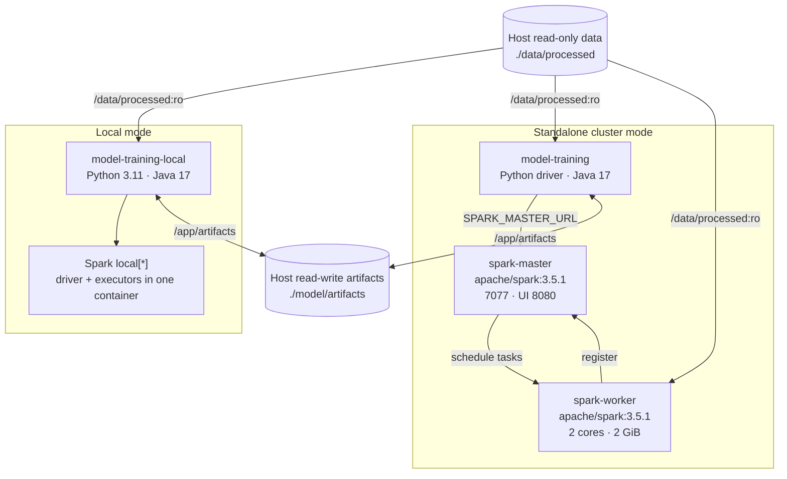
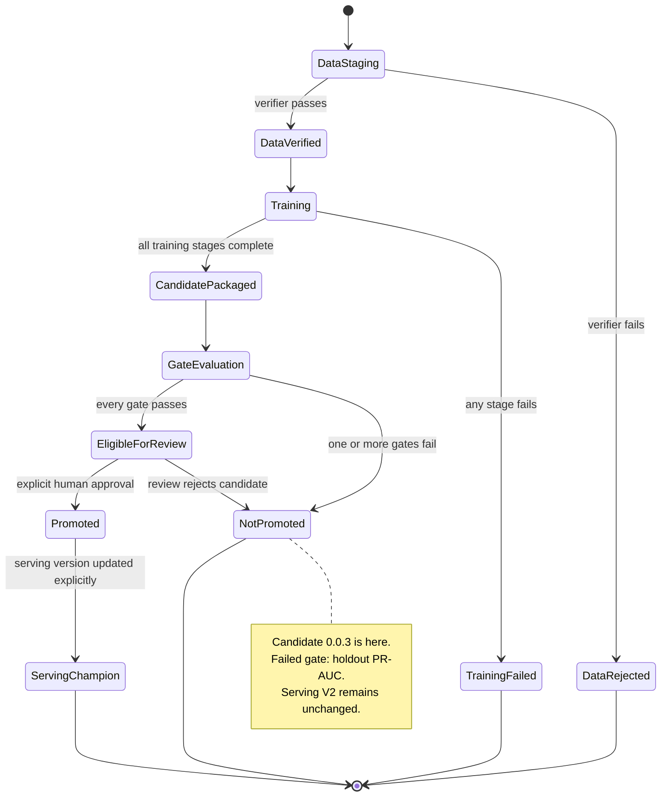

# Fraud Detection Architecture Diagrams

**Phạm vi:** Data Pipeline và Model Training  
**Trạng thái:** As-built tại ngày 31/07/2026  
**Định dạng:** UML-like diagram-as-code bằng Mermaid 11.16.0 + SVG vector  

Tài liệu này mô tả kiến trúc đã triển khai, không phải kiến trúc đề xuất.
Mỗi sơ đồ chỉ trả lời một câu hỏi ở một mức trừu tượng. GitHub là renderer
chính; phần mô tả dưới mỗi hình là text fallback cho môi trường không render
được Mermaid.

Các bản SVG chất lượng cao nằm tại [`docs/diagrams/`](diagrams/README.md).
Mermaid source trong tài liệu này là source of truth; SVG là generated export.

## 1. Bản đồ kiến trúc tổng thể

**Câu hỏi:** Dữ liệu đi từ IEEE-CIS đến candidate model và serving champion
như thế nào?

[Mở bản SVG](diagrams/01-system-overview.svg)

Điểm chính: offline workflow chỉ tạo candidate. Promotion gate không có quyền
tự thay model đang phục vụ. Candidate `0.0.3` hiện ở trạng thái
`not_promoted`, vì vậy V2 vẫn là champion.

Nguồn triển khai:

- `pipeline/fraud_risk_data_pipeline.py`
- `scripts/train_model.ps1`
- `model/src/fraud_model/package_candidate.py`
- `model/src/fraud_model/promotion_gate.py`

## 2. Data Pipeline chi tiết

**Câu hỏi:** Pipeline tạo model-ready data mà không học statistic từ tương lai
như thế nào?

[Mở bản SVG](diagrams/02-data-pipeline.svg)

Điểm chính: split boundary được xác định trước mọi phép fit. Historical
features chạy trên stream theo thời gian nhưng mỗi hàng chỉ nhìn các sự kiện
trước nó. Imputation và outlier caps chỉ học từ training window.

Nguồn triển khai:

- `config/pipeline_config.yaml`
- `data/ieee_cis/pipeline/ieee_cis_preprocess.py`
- `pipeline/temporal_features.py`
- `pipeline/verify_processed_data.py`

## 3. Timeline dữ liệu và các cửa sổ đánh giá

**Câu hỏi:** Mỗi khoảng thời gian được dùng cho quyết định nào?

[Mở bản SVG](diagrams/03-temporal-windows.svg)

Quy tắc đọc:

1. model family và hyperparameters chỉ được chọn trên `selection`;
2. calibrator chỉ fit trên `calibration`;
3. review/reject thresholds chỉ chọn trên `policy`;
4. holdout chỉ mở sau khi ba quyết định trên đã freeze;
5. không quay lại tune sau khi xem holdout.

## 4. Data contract và handover

**Câu hỏi:** Model team nhận những gì, và không cần làm lại những gì?

[Mở bản SVG](diagrams/04-data-contract.svg)

Model workflow đọc trực tiếp model-ready Parquet. Nó không join lại raw CSV,
không chia lại train/validation/holdout và không fit lại preprocessing của data
pipeline.

## 5. Model Training lifecycle

**Câu hỏi:** Candidate được chọn, hiệu chỉnh, đánh giá và đóng gói như thế nào?

[Mở bản SVG](diagrams/05-model-training-lifecycle.svg)

Candidate `0.0.3` đạt ROC-AUC, precision, calibration, checksum, artifact-load,
data-contract, version và lineage gates. Nó không đạt holdout PR-AUC gate nên
không được promote.

Nguồn triển khai:

- `model/src/fraud_model/validate_data.py`
- `model/src/fraud_model/train_baseline.py`
- `model/src/fraud_model/train_compare.py`
- `model/src/fraud_model/tune_and_explain.py`
- `model/src/fraud_model/threshold_analysis.py`
- `model/src/fraud_model/evaluate_holdout.py`
- `model/src/fraud_model/package_candidate.py`
- `model/src/fraud_model/promotion_gate.py`

## 6. Runtime sequence của một training run

**Câu hỏi:** Các thành phần tương tác theo thứ tự nào khi chạy workflow?

[Mở bản SVG](diagrams/06-training-sequence.svg)

## 7. Deployment topology: local và standalone cluster

**Câu hỏi:** Local mode và cluster mode khác nhau ở đâu, và cùng đọc data như
thế nào?

[Mở bản SVG](diagrams/07-spark-deployment.svg)

Invariant quan trọng: driver và worker phải thấy cùng Parquet tại cùng absolute
path `/data/processed`. Arrow collection mặc định tắt; có thể opt-in bằng
`FRAUD_SPARK_ARROW_ENABLED=true` khi benchmark.

Nguồn triển khai:

- `docker-compose.yml`
- `model/Dockerfile`
- `model/src/fraud_model/spark_session.py`
- `scripts/train_model.ps1`

## 8. Candidate promotion state machine

**Câu hỏi:** Candidate được phép chuyển qua những trạng thái nào?

[Mở bản SVG](diagrams/08-promotion-state-machine.svg)

Không có transition tự động từ `CandidatePackaged` hoặc
`EligibleForReview` sang `ServingChampion`.

## 9. Traceability và cách duy trì

| View | Source of truth | Khi nào cập nhật |
| --- | --- | --- |
| Tổng quan | pipeline entry point, training script, promotion gate | Khi boundary hoặc ownership đổi |
| Data Pipeline | pipeline config, preprocess module, verifier | Khi split/feature/export contract đổi |
| Timeline | split config, temporal validation module | Khi ratio hoặc validation policy đổi |
| Data contract | processed manifest và verifier | Khi dataset/artifact/schema đổi |
| Model lifecycle | các training stage modules | Khi thêm/bỏ/reorder stage |
| Runtime sequence | training scripts và tracking module | Khi orchestration hoặc lineage đổi |
| Deployment | Dockerfile và Compose | Khi image, Spark mode hoặc mount đổi |
| Promotion states | package candidate và promotion gate | Khi approval/promotion policy đổi |

### Accessibility và export

- Các quan hệ đều có nhãn; không phụ thuộc vào màu để truyền đạt trạng thái.
- Mỗi sơ đồ có text summary và source paths làm fallback.
- Các flow chính dùng hướng trên-xuống để đọc tốt hơn trên màn hình hẹp.
- Mermaid source là artifact chuẩn. Khi cần nhúng vào báo cáo/slide, export
  sang SVG để giữ chữ sắc nét; dùng PNG chỉ khi công cụ đích không hỗ trợ SVG.
- Sau mỗi thay đổi kiến trúc, render lại toàn bộ Mermaid blocks và kiểm tra:
  syntax, nhãn bị cắt, edge crossing, khả năng đọc ở desktop và mobile.
