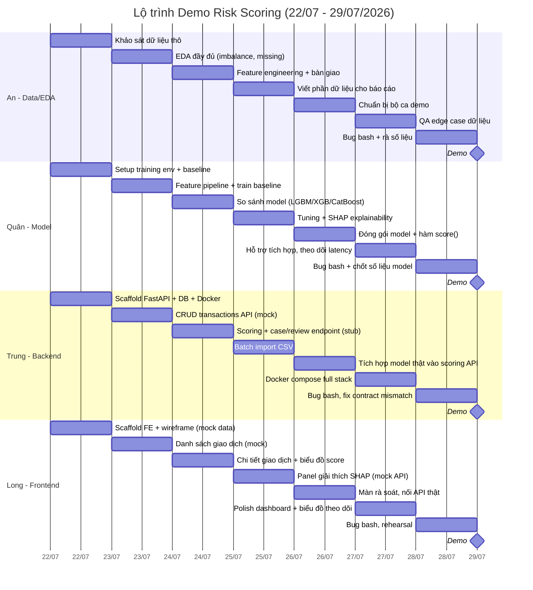

# Risk Scoring Engine — Kế hoạch Demo 8 ngày

Demo · 4 thành viên · **22/07/2026 → 29/07/2026 (8 ngày)**
Dataset: IEEE-CIS Fraud Detection (Kaggle/Vesta) · ~590k giao dịch · gian lận ~3.5%
Nhóm: **An (Data/EDA) · Quân (Model) · Trung (Backend) · Long (Frontend)**

Ứng dụng chấm điểm rủi ro (0–100) cho từng giao dịch dựa trên mô hình học máy huấn luyện từ IEEE-CIS, có API chấm điểm, dashboard xem điểm rủi ro + giải thích SHAP, và luồng rà soát/gắn nhãn thủ công.

Bản trình bày trực quan (HTML, có Gantt chart): [`risk-scoring-plan.html`](./risk-scoring-plan.html)

---

## 0. Trạng thái tiến độ (cập nhật 25/07 — Ngày 4)

| Người | Trạng thái |
|---|---|
| **An** | Xong. Pipeline Spark preprocessing đã chạy + verify (`ready_for_downstream_training`), bàn giao `model_ready/{train_weighted,validation,holdout,...}` + docs contract (`HANDOVER_TO_QUAN.md`, `DATA_DICTIONARY.md`). |
| **Quân** | Xong Ngày 1–4, bàn giao sớm 1 ngày. Đã train trên feature contract thật của An (không còn dùng feature giả): baseline → so sánh LightGBM/XGBoost/CatBoost → tuning + SHAP. Model cuối: **LightGBM**, validation ROC-AUC 0.888/PR-AUC 0.482, holdout (đánh giá 1 lần) ROC-AUC 0.868/PR-AUC 0.430 — vượt Decision Tree demo của An (holdout PR-AUC 0.298). Module `score(features) -> {proba, shap}` đã đóng gói, đang push nhánh `quan/real-features` + mở PR cho Trung. |
| **Trung** | Chưa bắt đầu tích hợp thật — `backend/` mới có FastAPI stub (mock). |
| **Long** | Chưa bắt đầu — `frontend/` mới có Vite scaffold (mock). |

---

## 1. Mục tiêu & phạm vi rút gọn cho 8 ngày

Với 8 ngày, **không làm một hệ thống hoàn chỉnh** — chỉ cần chứng minh pipeline chạy được end-to-end với 1 model tốt nhất đã chọn.

**Trong phạm vi**
- 1 model duy nhất đã so sánh & chọn (không thử nghiệm dàn trải)
- API chấm điểm 1 giao dịch + giải thích SHAP top-5
- Dashboard: danh sách giao dịch, chi tiết + SHAP, màn rà soát gắn nhãn
- Docker chạy local cho buổi demo

**Cắt bỏ hoàn toàn (để dồn lực cho core pipeline)**
- Đăng nhập/phân quyền — dùng 1 tài khoản demo cứng hoặc không cần login
- Retraining tự động, model registry nhiều phiên bản
- Streaming thật, deploy cloud — chạy `docker compose up` tại máy demo là đủ
- Bảng theo dõi drift phức tạp — chỉ cần 1 biểu đồ PR-AUC tĩnh

---

## 2. Phân công 4 người

### An — Data Processing & EDA
- Khảo sát, làm sạch, phân tích bộ IEEE-CIS (`transaction` + `identity`)
- Xử lý mất cân bằng lớp, missing values, chia train/val theo thời gian (`TransactionDT`)
- Feature engineering (aggregation theo card/email/device) → bàn giao script cho Quân
- Chuẩn bị bộ ca demo (vài giao dịch fraud/legit thật để trình diễn trực tiếp)

### Quân — Huấn luyện & đóng gói mô hình
- Nhận feature pipeline từ An, train baseline (Logistic Regression)
- So sánh nhiều model (LightGBM, XGBoost, CatBoost) trên PR-AUC/ROC-AUC
- Tuning model tốt nhất, sinh giải thích SHAP
- Đóng gói model cuối thành module `score(features) -> {proba, shap}` để Trung gọi
- Xử lý dữ liệu (load/merge/split/feature prep) chạy trên **PySpark**, convert
  sang pandas ngay trước khi train (sklearn/LightGBM/XGBoost/CatBoost không
  đọc trực tiếp Spark DataFrame). Spark cluster (`spark-master`/`spark-worker`)
  nằm trong profile Docker Compose riêng (`--profile training`), không ảnh
  hưởng service demo chấm điểm — xem `model/README.md`.

### Trung — Backend
- Scaffold FastAPI + schema CSDL (PostgreSQL) + Docker
- API: transactions (CRUD/list/detail), scoring, case/review, import CSV batch
- Tích hợp module `score()` của Quân vào API chấm điểm thật
- Docker Compose full stack cho buổi demo

### Long — Frontend
- Scaffold FE (React + TypeScript), wireframe, layout
- Danh sách giao dịch + filter theo mức rủi ro
- Chi tiết giao dịch: điểm số, quyết định, biểu đồ SHAP top-5
- Màn rà soát: duyệt/từ chối/gắn nhãn, nối API thật của Trung

---

## 3. Gantt chart — lịch 8 ngày

### Điểm đồng bộ bắt buộc (sync checkpoint)

| Ngày | Mốc | Ai giao — ai nhận |
|---|---|---|
| 22/07 (Ngày 1) | Chốt hợp đồng API (JSON mẫu) trước cuối ngày | Trung + Long thống nhất, không chờ dữ liệu thật |
| 24/07 (Ngày 3) | Feature pipeline bàn giao | An → Quân |
| 26/07 (Ngày 5) | Model đóng gói `score()` bàn giao — **xong sớm 25/07**, xem mục 0 | Quân → Trung |
| 27/07 (Ngày 6) | Tích hợp full stack lần đầu, tất cả cùng test | Cả 4 người |
| 28/07 (Ngày 7) | Bug bash toàn bộ + tổng duyệt kịch bản demo | Cả 4 người |
| 29/07 (Ngày 8) | Demo | Cả 4 người |

---

## 4. Lịch chi tiết theo ngày

| Ngày | Ngày dương lịch | An (Data/EDA) | Quân (Model) | Trung (Backend) | Long (Frontend) |
|---|---|---|---|---|---|
| 1 | 22/07 Thứ 4 | Khảo sát dữ liệu thô, báo cáo chất lượng | Setup training env, chạy thử baseline pipeline | Scaffold FastAPI + DB schema + Docker | Scaffold FE, wireframe, render mock data |
| 2 | 23/07 Thứ 5 | EDA đầy đủ: imbalance, missing, phân phối feature | Feature pipeline theo EDA, train baseline (LogReg) | CRUD transactions API (trả score mock) | UI danh sách giao dịch (mock data) |
| 3 | 24/07 Thứ 6 | Hoàn thiện feature engineering, **bàn giao cho Quân** | So sánh LightGBM / XGBoost / CatBoost theo PR-AUC | Scoring endpoint (stub) + case/review endpoint | UI chi tiết giao dịch + biểu đồ điểm số |
| 4 | 25/07 Thứ 7 | Viết phần dữ liệu cho báo cáo, hỗ trợ review feature | Tuning model tốt nhất, sinh SHAP explainability | Batch import CSV, tạm nối API với mock model | Panel giải thích SHAP (dùng mock API) |
| 5 | 26/07 Chủ nhật | Chuẩn bị bộ ca demo (fraud/legit mẫu) | **Đóng gói model cuối** + hàm `score()` + docs | **Tích hợp model thật** vào scoring API | Màn rà soát (duyệt/từ chối/gắn nhãn), nối API thật |
| 6 | 27/07 Thứ 2 | QA edge case dữ liệu (thiếu identity, outlier) | Hỗ trợ debug tích hợp, theo dõi latency scoring | Docker compose full stack, chạy thử tích hợp | Polish dashboard, biểu đồ theo dõi PR-AUC |
| 7 | 28/07 Thứ 3 | Bug bash, rà lại số liệu trình bày | Bug bash, chốt số liệu model cho slide | Bug bash, fix lỗi hợp đồng API | Bug bash, polish UI, tổng duyệt |
| 8 | 29/07 Thứ 4 | **Demo** | **Demo** | **Demo** | **Demo** |

---

## 5. Rủi ro với lịch 8 ngày

**CAO · Không đủ thời gian nếu chờ tuần tự**
Nếu Trung chờ Quân xong model rồi mới code API, hoặc Long chờ Trung xong API rồi mới code UI, 8 ngày là không đủ. Bắt buộc làm song song với **mock/stub trước** (An/Quân dùng dữ liệu giả lập response, Long dùng mock JSON) — chỉ tích hợp thật vào Ngày 5–6.

**CAO · Data leakage do vội**
Áp lực thời gian dễ khiến bỏ qua bước chia train/test theo thời gian, dùng random split cho nhanh — dẫn đến số liệu ảo khi trình bày. An phải chốt cách chia dữ liệu ngay Ngày 1–2.

**TB · Đóng gói model trễ**
Nếu Ngày 5 Quân chưa đóng gói xong `score()`, Trung mất nốt thời gian còn lại để tích hợp. Nếu trễ, dùng tạm model baseline (Logistic Regression) để demo pipeline chạy được, thay model tốt hơn sau nếu kịp.

**THẤP · Thiếu dữ liệu identity**
Bảng `identity` chỉ khớp ~24% giao dịch. An cần xử lý rõ trường hợp thiếu ngay từ Ngày 1, không để pipeline lỗi khi thiếu identity.

---

## 6. Checklist demo (29/07/2026)

- [ ] Import 1 batch CSV giao dịch mẫu, điểm rủi ro hiện ra trong dashboard
- [ ] Mở 1 giao dịch điểm cao, chỉ ra top feature SHAP giải thích vì sao
- [ ] Rà soát 1 case: gắn nhãn, hệ thống lưu phản hồi
- [ ] Trình bày rõ vì sao chọn model này (so sánh PR-AUC giữa các model)
- [ ] Trình bày rõ cách chia train/test theo thời gian (chống leakage)
- [ ] Mỗi người trình bày đúng phần mình phụ trách (Data / Model / BE / FE)
- [ ] Có kịch bản dự phòng (video quay sẵn) nếu demo trực tiếp lỗi
