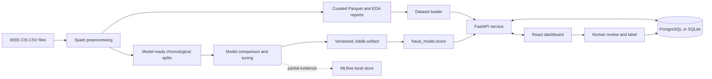
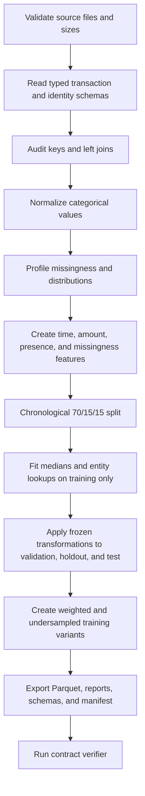
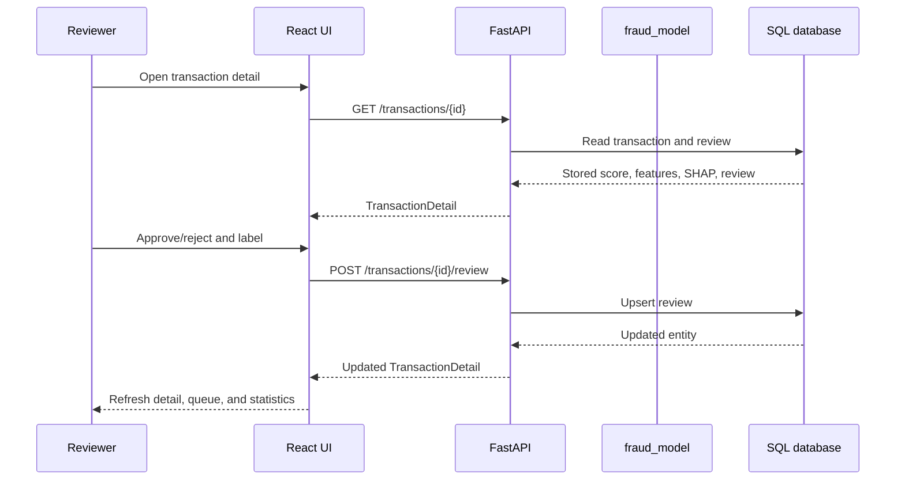
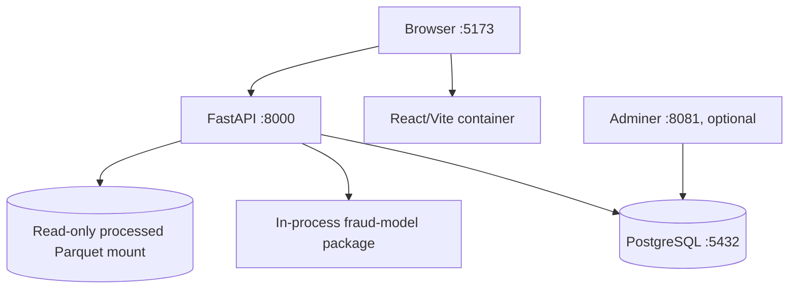

# Fraud Detection and Risk Scoring System — As-Built Documentation

**Evidence snapshot:** 30 July 2026

**Audience:** software engineers, data engineers, ML engineers, reviewers, and thesis examiners
**Repository status covered:** the local working tree and its available processed-data/model artifacts

## 1. Technical summary

This repository implements an end-to-end demonstration system for detecting risky
e-commerce transactions. It converts the IEEE-CIS Fraud Detection CSV files into
leakage-controlled Parquet datasets with Apache Spark, trains and compares several
binary classifiers, exposes real-time scoring through FastAPI, stores scored
transactions and human reviews, and provides a React dashboard for investigation.

The strongest verified statements about the current system are:

- The processed-data handoff is internally consistent. The saved verifier reports
  `82` passed checks, `0` failed checks, and the terminal status
  `ready_for_downstream_training`.
- The saved V2 model metadata identifies LightGBM as the offline champion. Its
  reported holdout ROC-AUC is `0.8796` and holdout PR-AUC is `0.4582`.
- V2 is the default model version in `model/src/fraud_model/config.py`, with V1
  available through the `FRAUD_MODEL_SERVING_VERSION` rollback variable.
- FastAPI, SQLAlchemy, React, Docker Compose, SHAP explanations, CSV import,
  dataset loading, review decisions, and risk-band presentation are implemented.
- The repository is suitable as a technical demonstration, but it is not yet a
  production fraud-control platform. Authentication, durable job orchestration,
  database migrations, monitored model promotion, calibrated operating policies,
  drift monitoring, and audited model registry controls remain out of scope.

Claims about saved model quality are **artifact-reported** unless a current test
run reproduced them. The local environment used for this review did not initially
contain LightGBM, so loading the V2 Joblib artifact was not treated as verified
serving evidence.

## 2. System scope and users

### 2.1 Business problem

The system assigns each transaction:

- a fraud probability in `[0, 1]`;
- a rounded risk score in `[0, 100]`;
- one of five risk bands;
- an automatic `approve`, `review`, or `reject` decision;
- up to five local SHAP contributions when a supported tree model is available.

The score is intended to prioritize manual investigation and demonstrate a
closed-loop review workflow. It is not documented as an approved financial
decision policy.

### 2.2 Primary user journeys

1. A data engineer supplies the four IEEE-CIS source CSV files and runs the Spark
   preprocessing workflow.
2. An ML engineer trains a versioned model from the verified model-ready Parquet
   datasets.
3. An operator starts PostgreSQL, the FastAPI backend, and the React frontend.
4. A reviewer loads or imports transactions, inspects risk and SHAP evidence,
   and records an approved/rejected review with a fraud/legitimate label.
5. A developer can submit an ad-hoc feature dictionary to `/score` without
   persisting a transaction.

### 2.3 Explicit non-goals

- payment authorization or settlement;
- multi-tenant access control;
- guaranteed real-time feature computation from external entity stores;
- online learning or automatic promotion;
- regulatory case management;
- causal claims about why fraud occurred;
- a service-level objective for latency, availability, or throughput.

## 3. Repository and component map

| Area | Responsibility | Main technology |
|---|---|---|
| `pipeline/` and `data/ieee_cis/pipeline/` | Raw discovery, Spark processing, contracts, verification | Python, PySpark |
| `model/` | Model training, evaluation, SHAP, versioned scoring | PySpark, pandas, scikit-learn, LightGBM, XGBoost, CatBoost |
| `backend/` | API, persistence, imports, loading jobs, review workflow | FastAPI, SQLAlchemy, PostgreSQL/SQLite |
| `frontend/` | Operations dashboard and investigation workflow | React, TypeScript, Vite, TanStack Query |
| `docker/` and Compose files | Reproducible processing, training, and application services | Docker Compose |
| `docs/`, `reports/`, root contracts | Plans, contracts, validation evidence, handover notes | Markdown, HTML, PDF |

The system is a modular monorepo. The model is a Python path dependency of the
backend, not a separate network service.

## 4. End-to-end architecture

The following view shows the current batch-to-serving path. Solid arrows are
implemented data or request flows; the MLflow/model-registry area is only
partially evidenced.



The architecture deliberately separates Spark-heavy batch processing from
request-time inference. Spark categorical mappings are serialized into the model
artifact so the scoring path does not need a JVM.

## 5. Data subsystem

### 5.1 Input datasets

The pipeline expects:

| File | Observed size | Role |
|---|---:|---|
| `train_transaction.csv` | 683,351,067 bytes | Labeled transaction facts |
| `train_identity.csv` | 26,529,680 bytes | Optional identity/device attributes |
| `test_transaction.csv` | 613,194,934 bytes | Unlabeled competition transactions |
| `test_identity.csv` | 25,797,161 bytes | Optional test identity attributes |
| `sample_submission.csv` | 6,080,314 bytes | Optional competition template |

The source inventory records checksums and reports approximately 1.29 GB across
the four required inputs. Source data is mounted at runtime and excluded from
Docker images and Git.

### 5.2 Processing sequence

The maintained root entry point is `pipeline/fraud_risk_data_pipeline.py`; the
substantial Spark implementation is in
`data/ieee_cis/pipeline/ieee_cis_preprocess.py`.



This ordering is important: split-dependent transforms are learned only from the
training window. Validation and holdout retain their natural class prevalence.

### 5.3 Join behavior

Transaction files are the row-preserving side of a left join on
`TransactionID`.

| Split | Transaction rows | Identity rows matched | Unmatched transactions | Row difference |
|---|---:|---:|---:|---:|
| Train | 590,540 | 144,233 | 446,307 | 0 |
| Test | 506,691 | 141,907 | 364,784 | 0 |

Identity is therefore optional for most records. The feature contract includes
presence and missingness indicators instead of discarding unmatched transactions.

### 5.4 Chronological splits and class imbalance

| Dataset | Rows | Fraud | Legitimate | Fraud rate |
|---|---:|---:|---:|---:|
| `train_original` | 412,956 | 14,522 | 398,434 | 3.5166% |
| `train_weighted` | 412,956 | 14,522 | 398,434 | 3.5166% |
| `train_balanced` | 58,394 | 14,522 | 43,872 | 24.8690% |
| `validation` | 88,490 | 3,036 | 85,454 | 3.4309% |
| `holdout` | 89,094 | 3,105 | 85,989 | 3.4851% |
| `kaggle_test` | 506,691 | — | — | — |

Training ends at `TransactionDT=10,432,902`; validation begins at
`10,432,915` and ends at `13,136,653`; holdout begins at `13,136,664`.
The verifier found no `TransactionID` overlap between labeled splits.

The primary training variant preserves all rows and supplies `class_weight`.
The balanced variant keeps all fraud observations and deterministically samples
legitimate observations at roughly `3:1`. It is an experimental alternative,
not the probability-calibration reference distribution.

### 5.5 Feature contract

The current canonical list contains 68 features:

- **amount:** raw, log-transformed, capped, decimal, amount band, and deviation
  from historical card mean;
- **time:** raw transaction time, day/week/hour proxies, age, and night flag;
- **missingness and presence:** identity/device/email/distance/address presence
  plus selected and identity missingness ratios;
- **anonymized behavior:** selected `C`, `D`, and distance variables;
- **historical aggregates:** prior counts, sums, means, standard deviation, and
  time since prior transaction for card/email/device entities;
- **categorical:** `ProductCD`, `card4`, `card6`, `DeviceType`,
  `device_family`, `M4`, and `amount_band`.

The canonical order is saved in
`artifacts/preprocessing/feature_order.json`. Identifiers, labels, weights,
split names, generated timestamps, and schema/version metadata are forbidden
from the model vector.

### 5.6 Null and unseen-category policy

Numeric medians and categorical policies are persisted as preprocessing
artifacts. Categorical indexers are fitted on training only and use a dedicated
unknown/missing code when serving receives unseen values. At request time,
missing or explicit `None` values are converted to the numeric sentinel `-999`
after categorical encoding.

The scoring artifact may also declare `required_features`, `optional_features`,
and `defaultable_features`. Missing non-defaultable required features produce a
validation error; partial demo requests are identified separately from full
feature scoring.

### 5.7 Processed-data verification

The saved verification report checks:

- required datasets, columns, and artifacts;
- row counts and unique transaction identifiers;
- chronological order and split non-overlap;
- schema hashes and canonical feature order;
- label presence/absence by dataset;
- placement of `class_weight`;
- required report files and imputation artifacts.

Saved outcome: `ready_for_downstream_training`, `82` checks passed, `0` failed.
The top-level manifest still contains the earlier value
`verification_pending`; the dedicated verifier report is the later source for
verification status. This discrepancy should be corrected in a future pipeline
finalization change.

## 6. Model subsystem

### 6.1 Training boundary

Spark reads Parquet and applies the training-fitted categorical indexer.
`features.to_pandas_xy()` then converts the selected feature frame to pandas
because the candidate estimators are in-memory Python libraries.

This boundary is simple and demonstrable, but it collects the full training
matrix on the driver. The 412,956-row dataset is manageable in the demonstrated
environment but the architecture does not scale indefinitely without distributed
training or bounded sampling.

### 6.2 Training stages

| Stage | Command module | Output |
|---|---|---|
| Baseline | `fraud_model.train_baseline` | Logistic-regression artifact |
| Candidate comparison | `fraud_model.train_compare` | Validation ROC-AUC/PR-AUC JSON |
| Tune and explain | `fraud_model.tune_and_explain` | Final model, SHAP support, holdout metrics |
| Threshold analysis | `fraud_model.threshold_analysis` | Operating-point table when run |
| Holdout evaluation | `fraud_model.evaluate_holdout` | Final evaluation report when run |

The intended discipline is to select the model family and parameters on
validation and evaluate holdout once after selection.

### 6.3 Candidate results

The following values are read from the saved V2 comparison artifact. They are
validation metrics, not production performance.

| Model | Validation ROC-AUC | Validation PR-AUC |
|---|---:|---:|
| Logistic Regression | 0.8092 | 0.2518 |
| LightGBM | 0.8887 | 0.4770 |
| XGBoost | 0.8618 | 0.4538 |
| CatBoost | 0.8445 | 0.4298 |

LightGBM ranks first by validation PR-AUC. PR-AUC is emphasized because fraud is
only about 3.5% of the natural labeled splits.

### 6.4 V1 and V2 results

| Metric | V1 | V2 | Absolute change |
|---|---:|---:|---:|
| Validation ROC-AUC | 0.8877 | 0.8941 | +0.0064 |
| Validation PR-AUC | 0.4820 | 0.4925 | +0.0105 |
| Holdout ROC-AUC | 0.8684 | 0.8796 | +0.0112 |
| Holdout PR-AUC | 0.4298 | 0.4582 | +0.0283 |

V2 uses 68 features versus 53 in the legacy V1 artifact. The comparison is not
an isolated hyperparameter experiment: feature contract, metadata exclusion,
feature order, and tuning also changed. No causal attribution should be made
without a controlled ablation study.

### 6.5 Artifact and version behavior

Existing V2 artifacts are:

- `baseline_logreg_v2.joblib`;
- `final_model_v2.joblib`;
- `model_comparison_v2.json`;
- `training_metadata_v2.json`.

`FRAUD_MODEL_SERVING_VERSION` defaults to `v2`. V1 can read either a versioned
path or the legacy root artifact. Training and serving paths are separated so a
new training run need not overwrite the served version.

The artifact directory is Git-ignored and currently has no documented external
registry, immutable checksum manifest, or completed MLflow run history. The
saved metadata also contains a container-local `/app/artifacts/...` path. These
facts limit independent reproduction and auditability.

### 6.6 Scoring and explainability

`fraud_model.score.score()`:

1. loads the final artifact or a same-version baseline fallback;
2. validates required features;
3. applies persisted categorical mappings;
4. aligns the feature vector to the training order;
5. calls `predict_proba`;
6. applies an optional calibrator when present;
7. computes TreeSHAP contributions for supported tree models;
8. returns probability, SHAP top five, scoring mode, and optional threshold
   metadata.

SHAP values explain the underlying tree output. If a future artifact calibrates
the probability after model inference, the displayed SHAP contributions will not
decompose that calibrated probability directly.

### 6.7 Current model limitations

- Current artifacts do not include saved calibration/threshold files.
- Precision, recall, F1, false-positive count, and false-negative count at the
  operational decision boundary are not part of the V2 final metadata.
- Threshold metadata is not the authoritative backend decision policy.
- The fixed risk bands have not been tied to review capacity or explicit
  false-positive/false-negative costs.
- The local MLflow store contains experiment metadata but no completed run
  evidence.
- A missing model dependency can trigger the backend heuristic fallback, which is
  useful for a demo but unsafe as a silent production behavior.

## 7. Backend subsystem

### 7.1 Runtime and persistence

The backend is a FastAPI application with SQLAlchemy models. It uses PostgreSQL
in Docker and defaults to local SQLite when `DATABASE_URL` is absent. Tables are
created on startup with `Base.metadata.create_all`; Alembic migrations are not
implemented.

The backend imports the local `fraud-model` package directly. Startup attempts to
load/warm the model and SHAP explainer.

### 7.2 Data model

`Transaction` stores identifiers, amount, raw features, probability, risk score,
risk band, automatic decision, SHAP payload, model version, and scoring time.
`Review` stores the operator decision, manual label, reviewer, note, and update
time.

A transaction without a review is exposed as `review_status="pending"`.
Submitting a new review for the same transaction overwrites the existing review
state.

### 7.3 Risk policy

| Risk score | Band | Automatic decision |
|---:|---|---|
| 0–19 | `low` | `approve` |
| 20–39 | `guarded` | `approve` |
| 40–59 | `medium` | `review` |
| 60–79 | `high` | `review` |
| 80–100 | `critical` | `reject` |

The score is `round(fraud_probability × 100)` after clamping to the supported
range. The policy is fixed in backend code and is distinct from an operator's
review status.

### 7.4 API groups

- **health and metadata:** health status, model/schema versions, feature
  requirements, explainability, and risk bands;
- **ad-hoc scoring:** score a feature dictionary without database persistence;
- **transaction exploration:** pagination, filtering, sorting, search, aggregate
  statistics, detail, and manual review;
- **CSV import:** synchronous bounded upload with feature-coverage diagnostics;
- **dataset management:** list processed datasets and start a background
  `head`, deterministic `sample`, or risk-band `coverage` load;
- **job management:** inspect active/completed in-memory jobs and request
  cancellation.

The precise wire contract is maintained in `docs/API_CONTRACT.md`.

### 7.5 Loading and imports

The recommended demonstration dataset is `holdout` because it is labeled,
retains natural prevalence, and was not used for training. The default seed
limit is 5,000 rows. The `coverage` mode intentionally obtains examples from all
five risk bands for demonstration; it is not a representative statistical
sample.

CSV upload is capped at 5,000 rows by default. Each row is scored synchronously
and upserted by transaction identifier. Larger processed datasets should be
loaded through the background loader.

### 7.6 Backend limitations

- No authentication, authorization, rate limiting, or tenant isolation.
- CORS is configured for local development origins.
- Job state is in process memory, supports one active loader, and is lost on
  restart.
- CSV import holds the request open during scoring.
- There is no bulk re-score endpoint; database rows can contain multiple model
  versions after a promotion.
- The application image includes training-heavy dependencies such as PySpark.
- Health returns process health rather than a strict “real model loaded” gate.

## 8. Frontend subsystem

### 8.1 Application pages

| Route | Purpose |
|---|---|
| `/` | Transaction list, KPI tiles, filters, sorting, and pagination |
| `/transactions/:id` | Score details, feature values, SHAP chart, and review form |
| `/review` | Pending transactions with risk score at least 40 |
| `/score` | Ad-hoc partial feature scoring |
| `/import` | Dataset loading, CSV template/download/import, and job progress |

The SPA uses an API abstraction that can switch to JSON mocks with
`VITE_USE_MOCKS=true`. This lets frontend development continue without a live
backend, but mock scores are not model evidence.

### 8.2 State and data flow

TanStack Query owns server state, caching, polling, and invalidation. Local
preferences store theme and density. API types in
`frontend/src/types/api.ts` mirror backend Pydantic schemas manually. At this
snapshot, those TypeScript types lag the backend for version/feature metadata and
`scoring_mode`; runtime JSON accepts the extra fields, but compile-time consumers
cannot rely on them until the types are synchronized.



The interface displays the model version and whether SHAP is available. When the
backend returns `shap_top5=null`, the UI renders an explicit unavailable state
instead of failing.

### 8.3 Investigation assistance

The frontend includes a rule-based chat dock that can parse a bounded set of
commands and summarize already loaded transaction/model information. It is not a
large-language-model integration and should not be described as natural-language
fraud reasoning.

### 8.4 Accessibility and responsive design

The UI includes:

- visible labels and focus styles;
- semantic status text in addition to color;
- an accessible table fallback for SHAP bars;
- light, dark, and system theme support;
- `prefers-reduced-motion` handling;
- responsive layouts and enlarged mobile touch targets.

The project documents manual contrast and viewport checks, but it has no
automated component, accessibility, or end-to-end browser tests.

### 8.5 Frontend limitations

- no route-level code splitting;
- no automated frontend tests;
- no internationalization; user-facing strings are primarily Vietnamese;
- manually synchronized API types rather than generated OpenAPI types;
- the chat assistant is deterministic and rule based.

## 9. Deployment and operations

### 9.1 Default application stack



| Service | Port | Default profile |
|---|---:|---|
| Frontend | 5173 | default |
| Backend/Swagger | 8000 | default |
| PostgreSQL | 5432 | default |
| Adminer | 8081 | `tools` |
| Spark master UI | 8080 | `training` |
| Spark master | 7077 | `training` |

The processed Parquet directory is mounted read-only into the backend and is not
part of the image. The backend build context is the repository root because its
Python project has a path dependency on `../model`.

### 9.2 Training topology

The optional `training` profile starts a Spark master, Spark worker, and
model-training container. A separate local-Spark training service supports
environments where the cluster images are unavailable.

### 9.3 Environment configuration

| Variable | Purpose | Current default |
|---|---|---|
| `DATABASE_URL` | SQLAlchemy database connection | local SQLite |
| `CORS_ORIGINS` | Allowed browser origins | local Vite/preview origins |
| `DATA_PROCESSED_DIR` | Host processed-data mount | `./data/processed` |
| `SEED_DATASET` | Dataset used by CLI seed | `holdout` |
| `SEED_LIMIT` | Seed row count | `5000` |
| `MAX_IMPORT_ROWS` | CSV upload cap | `5000` |
| `FRAUD_MODEL_SERVING_VERSION` | Served artifact version | `v2` |
| `FRAUD_MODEL_TRAINING_VERSION` | Training output version | `v2` |
| `SPARK_MASTER_URL` | Spark connection | local or profile-specific |
| `MLFLOW_TRACKING_URI` | Optional external tracking backend | local artifact path |

### 9.4 Standard commands

```powershell
# Full application
docker compose up --build

# Preprocessing
docker compose -f docker-compose.preprocessing.yml build
docker compose -f docker-compose.preprocessing.yml run --rm preprocess
docker compose -f docker-compose.preprocessing.yml run --rm verify-processed

# Optional training cluster
docker compose --profile training up -d spark-master spark-worker
docker compose --profile training run --rm model-training `
  uv run python -m fraud_model.train_baseline

# Local backend
Set-Location backend
uv sync --frozen
uv run uvicorn fraud_backend.main:app --reload

# Local frontend
Set-Location frontend
npm ci
npm run dev
```

Native Windows Spark is documented as suitable for exploration but not the
canonical full Parquet output path. Linux Docker is the supported batch path.

## 10. Testing and validation

### 10.1 Existing automated coverage

| Area | Existing checks |
|---|---|
| Processed data | 82 contract, schema, row, split, and artifact checks |
| Model features | train-only categorical fit, unseen categories, alignment |
| Model scoring | probability bounds, SHAP behavior, missing values, fallback |
| Model quality | minimum committed holdout bar when artifact is available |
| Backend risk | boundaries and complete coverage of scores 0–100 |
| Backend API | health, metadata, list/stats/detail, review, score, CSV import |
| Frontend | TypeScript build, linter, custom static UI checker |

Only the model has a repository GitHub Actions workflow. Backend and frontend
checks are documented but not enforced by CI in the inspected repository.

### 10.2 Evidence classifications

| Label | Meaning |
|---|---|
| Verified now | Command executed successfully during the current review |
| Artifact-reported | Value read from a saved machine-readable output |
| Previously validated | Result recorded in an existing dated validation report |
| Implemented | Behavior is present in source but was not exercised end to end |
| Not evidenced | Claimed or planned behavior has no adequate saved/run evidence |

This classification prevents source-code presence from being reported as a
successful production run.

## 11. Security, privacy, and governance

The dataset is anonymized, but the system still processes transaction-level
behavior. A production design would require retention rules, access logs,
encryption policy, secret management, user authentication, authorization by
role, review audit history, and a documented response process.

Current Compose credentials (`fraud`/`fraud`) are development defaults and must
not be reused outside a local demonstration. Model artifacts loaded through
Joblib must come from a trusted build because deserialization can execute code.

Model governance gaps include missing immutable checksums, incomplete MLflow run
evidence, no registry promotion record, no drift monitor, no business-approved
thresholds, and no fail-closed serving health gate.

## 12. Current limitations and recommended next steps

### Immediate controls

1. Make dependency locking and container model loading reproducible.
2. Fail health/readiness when the expected model cannot load; make heuristic
   mode an explicit opt-in demo setting.
3. Produce precision, recall, F1, confusion counts, calibration, and latency
   evidence at candidate operating points.
4. Connect an approved review/reject threshold policy to backend decisions.
5. Record model checksum, dataset/schema versions, training configuration,
   MLflow run ID, and promotion/rollback evidence.

### Engineering hardening

1. Add Alembic migrations and durable background jobs.
2. Add authentication, authorization, audit events, secrets, and rate limits.
3. Generate frontend types from OpenAPI and add API contract tests.
4. Add frontend unit, accessibility, and end-to-end tests.
5. Separate model serving dependencies from training/Spark dependencies.
6. Add bulk re-scoring or version-isolated views before model promotion.

### Analytical hardening

1. Use time-based cross-validation or multiple temporal validation windows.
2. Separate model selection, calibration, threshold selection, and holdout
   evaluation windows.
3. Run controlled feature-group ablations.
4. Define review capacity and false-positive/false-negative cost assumptions.
5. Monitor prevalence, feature drift, calibration, score distribution, and
   delayed labels after deployment.

## 13. Evidence inventory

Primary repository evidence used for this document:

- source code under `pipeline/`, `data/ieee_cis/pipeline/`, `model/src/`,
  `backend/src/`, and `frontend/src/`;
- `data/processed/ieee_cis_fraud_risk/manifest.json`;
- processed-data split, join, class-balance, schema, and verification reports;
- V1/V2 comparison and V2 training metadata artifacts;
- model, backend, and frontend tests;
- Dockerfiles, Compose files, package manifests, and lock files;
- dated reports under `reports/`;
- existing data, API, and risk-score contracts.

The source dataset itself and generated Parquet/model artifacts are intentionally
not duplicated into this documentation.
