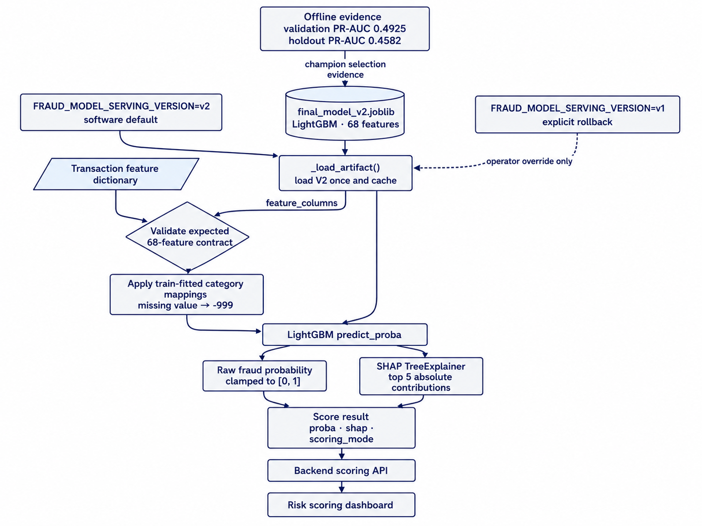

# Fraud Detection Architecture Image Gallery

## Final architecture exports

Các ảnh dưới đây là bộ tám sơ đồ cuối, sinh từ
[`../AN_FINAL_ARCHITECTURE_DIAGRAMS.md`](../AN_FINAL_ARCHITECTURE_DIAGRAMS.md).

1. [Overall system architecture](final/01.png)
2. [Layered data architecture](final/02.png)
3. [Detailed data processing pipeline](final/03.png)
4. [Leakage-controlled transformation flow](final/04.png)
5. [Data, feature and evaluation contracts](final/05.png)
6. [Model training lifecycle](final/06.png)
7. [Temporal development windows](final/07.png)
8. [Promotion state machine](final/08.png)

Các gallery phía dưới là export lịch sử, được giữ lại để traceability.

Các ảnh dưới đây được export riêng từ Mermaid source trong
[`../ARCHITECTURE_DIAGRAMS.md`](../ARCHITECTURE_DIAGRAMS.md). Nhấn vào tên ảnh
để mở file PNG gốc độ phân giải cao.

## 1. System overview

[Mở `01-system-overview.png`](png/01-system-overview.png)

## 2. Data Pipeline

[Mở `02-data-pipeline.png`](png/02-data-pipeline.png)

## 3. Temporal windows

[Mở `03-temporal-windows.png`](png/03-temporal-windows.png)

## 4. Data contract

[Mở `04-data-contract.png`](png/04-data-contract.png)

## 5. Model training lifecycle

[Mở `05-model-training-lifecycle.png`](png/05-model-training-lifecycle.png)

## 6. Training runtime sequence

[Mở `06-training-sequence.png`](png/06-training-sequence.png)

## 7. Spark deployment

[Mở `07-spark-deployment.png`](png/07-spark-deployment.png)

## 8. Promotion state machine

[Mở `08-promotion-state-machine.png`](png/08-promotion-state-machine.png)

## 9. Best Model V2 serving

[Mở `09-best-model-v2-serving.png`](png/09-best-model-v2-serving.png)

